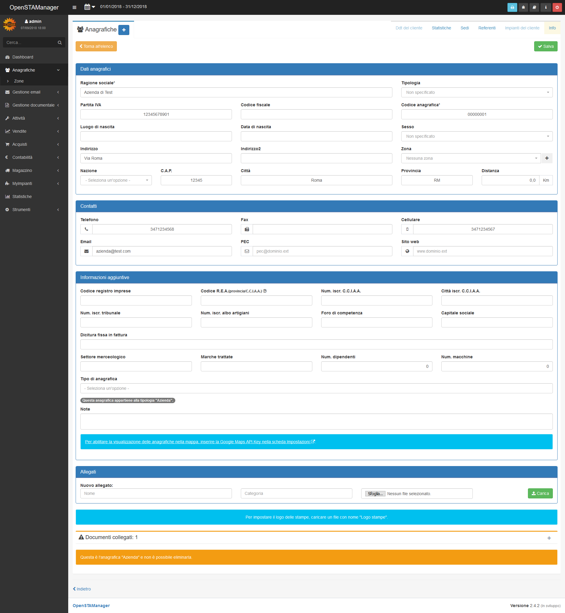
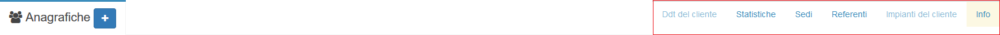

# Caratteristiche


OpenSTAManager presenta un'interfaccia generale piuttosto chiara, basata su strutture comuni e solitamente di semplice utilizzo.


## Navigazione

La navigazione attraverso le diverse sezioni del gestionale viene resa possibile dal menu laterale, visibile in ogni pagina e rappresentante i moduli a cui l'utente autenticato ha accesso.

Questo menu si compone generalmente di macro-sezioni per argomento \(quali **Attività**, **Vendite**, **Acquisti**\) che raggruppano diversi moduli al loro interno, generalmente visualizzabili cliccando sul simbolo  .

Il modulo corrente viene evidenziato, nel tema predefinito, con una scritta bianca più vivace delle altre. Per maggiori informazioni sui moduli, visitare la [sezione apposita](caratteristiche.md#modulo).

Nella parte più alta di questa componente è inoltre presente una barra di ricerca generalizzata all'interno del gestionale, che permette di effettuare ricerche tra i moduli che supportano questa funzione.

## Selezione temporale

Nella sezione in alto a sinistra di ogni modulo è possibile selezionare il periodo temporale a cui il gestionale farà riferimento per l'individuazione delle informazioni di ogni modulo.

Sono presenti diversi valori pre-impostati:

* Oggi
* I trimestre
* II trimestre
* III trimestre
* IV trimestre
* I semestre
* II semestre
* Questo mese
* Mese scorso
* Quest'anno \(_default_\)
* Anno scorso

Questa funzionalità è sfruttata in particolare da moduli in cui il periodo di tempo è rilevante \(quali, per esempio, **Attività** e **Fatture**\) mentre in altri non provoca alcun effetto \(per esempio, **Dashboard** e **Articoli**\).

## Opzioni di controllo


Parallelamente alla possibilità di selezionare il periodo temporale, vengono rese disponibili alcune opzioni aggiuntive nella sezione in alto a destra del software.


Viene qui permesso di procedere alle seguenti azioni, in ordine:

* Stampare la schermata attuale attraverso il browser
* Visitare la pagina per la segnalazione dei bug
* Visitare l'elenco dei propri tentativi di accesso
* Visitare la pagina di informazioni integrata in OpenSTAManager
* Effettuare il logout

## Modulo


I moduli sono la componente principale della struttura di OpenSTAManager. Sono progettati per avere una struttura facilmente personalizzabile e mantenere comportamenti indipendenti dal resto del software.

Ogni modulo si occupa in genere di un singolo argomento, che può essere rappresentato e considerato in vari modi. La navigazione è permessa attraverso il [menu laterale](caratteristiche.md#navigazione).


Ogni modulo gestisce le proprie informazioni in modo indipendente da OpenSTAManager, quindi non è possibile prevedere in modo completo il suo comportamento per l'utente finale. Per ottenere maggiori informazioni, è necessario visitare la guida relativa al singolo modulo.

### Tabella generale

I moduli più comuni del gestionale presentano, come schermata principale, una tabella in cui è possibile scorrere tutti gli elementi presenti al suo interno.

Cliccando sulla riga dell'elemento interessato, si verrà reindirizzati alla [schermata di modifica del _record_](caratteristiche.md#modifica-record).

Esempi di questo comportamento sono individuabili in **Anagrafiche**, **Attività**, **Articoli**, e in molti altri moduli predefiniti.

### Contenuti personalizzati

Eventualmente, esistono alcuni moduli con requisiti particolari per la propria schermata principale. In questi casi, è impossibile prevedere il tipo di informazioni presentabili e la modalità, che dipende dal singolo modulo.

Esempi di questa struttura sono presenti nei moduli **Dashboard** e **Statistiche**.

### Creazione record

I moduli che permettono la creazione di nuovi elementi presentano un pulsante apposito  vicino all'intestazione della pagina .

Una volta cliccato il pulsante in questione, verrà aperta una schermata sovrapposta al resto del software per permettere di inserire le informazioni del nuovo elemento.

### Modifica record

I moduli che permetto la modifica dei propri elementi visualizzano una schermata apposita dedicata alla gestione delle informazioni complete dei _record_.

Di seguito è possibile osservare una generica schermata che permette la suddetta modifica:

## Widget


Ogni modulo può presentare delle strutture denominate _**widget**_, che si presentano secondo una grafica comune ma possono eseguire una singola azione a seguito del click al di sopra di esse. In generale, queste componenti sono presenti nella parte alta o bassa della pagina \(in base alla configurazione\).

E' inoltre possibile che vi sia una differenza tra i _**widget**_ all'interno della schermata principale del modulo e nella sezione di modifica del _record_.


## Plugin

Ogni modulo può possedere delle sezioni note come _plugin_, che possono essere considerati come dei sotto-moduli per il modulo stesso. Questi sono navigabili attraverso l'apposito menu a destra dell'intestazione della pagina.

I plugin possono presentare comportamenti molto diversi, e sono in generale separati dal modulo a cui appartengono, malgrado vi siano collegati fortemente.

Per maggiori informazioni, visitare la documentazione dei [moduli](modules/).

Per gli amministratori, è inoltre presente un plugin _sperimentale_ denominato **Info** che permette di visualizzare la cronologia di modifica del _record_.

## Upload

OpenSTAManager presenta inoltre una struttura comune per la gestione di eventuali upload da parte dell'utente per il singolo elemento del modulo.

Questa funzione, qualora abilitata per il modulo in utilizzo, si presenta nel seguente modo:

