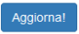
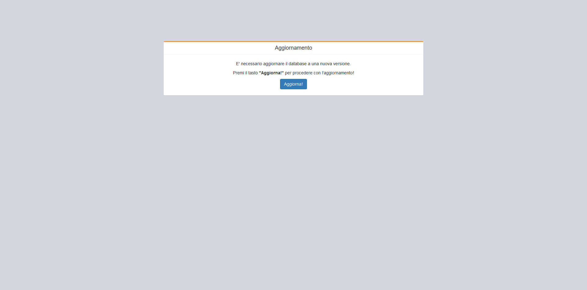
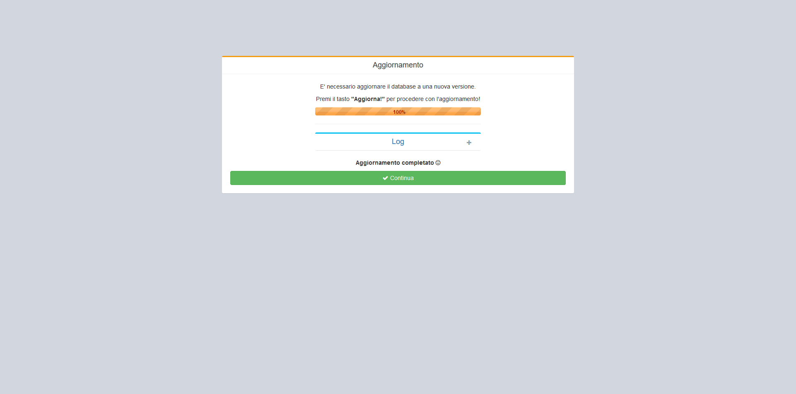
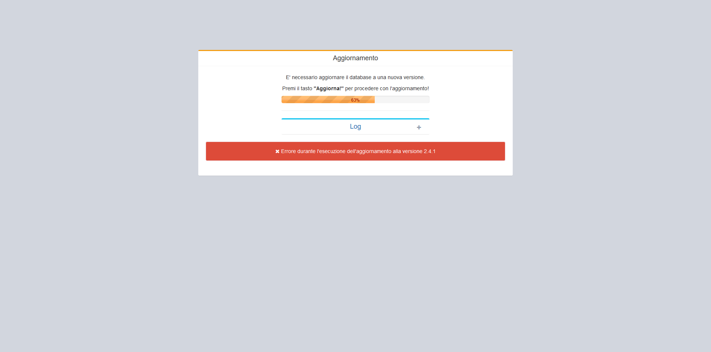
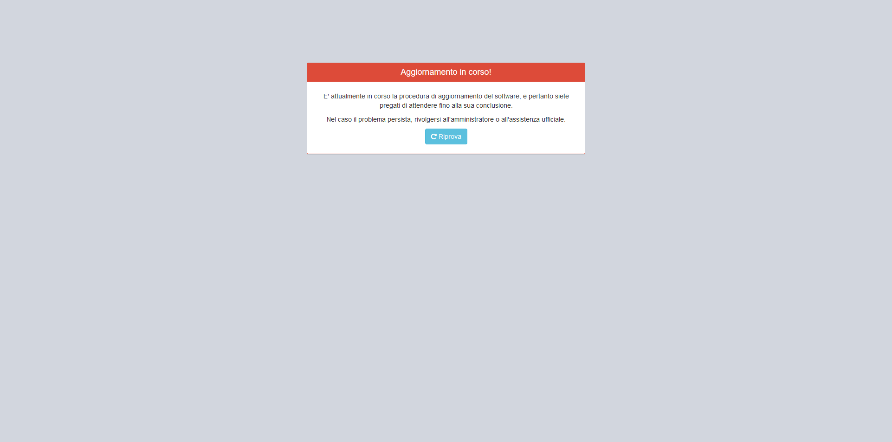

# Aggiornamento


**Attenzione**: Questa documentazione è esclusivamente relativa all'aggiornamento del software. Per maggiori informazioni sull'installazione consultare la documentazione relativa nella sezione [Installazione](installazione.md).


OpenSTAManager supporta due procedure distinte per il caricamento degli aggiornamenti:

* Automatici tramite caricamento del file ZIP nel modulo Aggiornamenti
* Manuali tramite la scompattazione del file ZIP

Per un approfondimento su entrambe queste tipologie, siete pregati di visitare la sezione sui [Dettagli tecnici](aggiornamento.md#dettagli-tecnici).

Dopo il caricamento dell'aggiornamento, si possono in genere verificare due situazioni:

* L'aggiornamento **non** richiede di modificare il database, e quindi non sono necessarie ulteriori azioni
* L'aggiornamento richiede di modificare il database

In quest'ultimo caso, ogni utente presente all'interno del gestionale verrà automaticamente reindirizzato verso il logout e sarà possibile aggiornare il database come richiesto attraverso delle apposite schermate e il pulsante  .

## Errori di aggiornamento

La procedura di aggiornamento, come ogni componente software, è soggetta a possibili errori.

Nel caso questi si verifichino, l'utente dovrebbe riuscire a visualizzare il seguente messaggio informativo:

In questi casi, si consiglia di contattare gli sviluppatori ufficiali e di consultare il [forum ufficiale](https://www.openstamanager.com/forum/) per eventuali segnalazioni simili.

## Aggiornamento in corso


Mentre l'aggiornamento è in esecuzione, il gestionale rimarrà bloccato per tutti gli utenti ad eccezione di quello responsabile dell'inizio della procedura di aggiornamento.

Nel caso la procedura rimanga persistente per un periodo molto prolungato di tempo, è possibile che si sia verificato un errore non rilevato dall'utente durante l'aggiornamento. In questo caso si consiglia di consultare la sezione di [Ripresa forzata](aggiornamento.md#ripresa-forzata) oppure di contattare gli sviluppatori ufficiali.


## Ripresa forzata

In alcuni casi particolari, può essere necessario riprendere forzatamente l'esecuzione di un aggiornamento andato in errore.

Questo viene reso possibile visitando l'URL a cui è possibile accedere a OpenSTAManager con l'aggiunta del testo `?force`.


**Attenzione**: quest'azione è sconsigliata a utenti non esperti.


## Dettagli tecnici

### Aggiornamento semplificato

La procedura di aggiornamento semplificato ha l'obiettivo di fornire un sistema di facile utilizzo per favorire l'aggiornamento, e migliorare in questo modo l'interazione con l'utente finale.

L'utilizzo di questa procedura è però sottoposto alla seguenti condizioni nelle impostazioni PHP:

* `upload_max_filesize` >= 16MB
* `post_max_size` >= 16MB

Di seguito la procedura:

1. Accedere con un account amministrativo
2. Entrare nel modulo **Aggiornamenti** (disponibile nel menu principale a sinistra, eventualmente sotto la dicitura **Strumenti**)
3. Selezionare il file _.zip_ della release attraverso l'apposita sezione "Carica un aggiornamento" e cliccare sul pulsante "Carica"

Dopo l'esecuzione di queste azioni, il gestionale effettuerà automaticamente il logout di tutti gli utenti connessi e renderà disponibile l'interfaccia di aggiornamento.

### Aggiornamento manuale

La procedura di aggiornamento manuale è resa disponibile per ovviare ai problemi relativi al caricamento del file _.zip_ (in alcuni casi il file non viene correttamente rilevato, non sono disponibili i permessi per caricare file oppure la dimensione del file eccede il limite di upload sul server).

Di seguito la procedura:

1. De-comprimere il contenuto del file _.zip_ in una cartella temporanea
2. Rinominare il file `VERSION` dell'installazione corrente in `VERSION.old` (rispettando minuscole e maiuscole) \[facoltativo a partire dalla versione 2.3]
3. Copiare i file della nuova versione dalla cartella temporanea alla cartella del server, in modo che le cartelle principali (`files`, `modules`, `templates`, ...) vengano sovrascritte

Dopo l'esecuzione di queste azioni, il gestionale effettuerà automaticamente il logout di tutti gli utenti connessi e renderà disponibile l'interfaccia di aggiornamento.

### Migrazione dalla versione 1.x

E' possibile effettuare la migrazione da una qualsiasi versione 1.x alla nuova 2.0, seguendo una procedura un po’ diversa dalle precedenti:

1. Scaricare la versione 2.0 per la migrazione da SourceForge ([openstamanager-2.0-migrazione.zip](https://sourceforge.net/projects/openstamanager/files/openstamanager/openstamanager-2.x/))
2. Creare un backup completo della versione in uso
3. De-comprimere il contenuto del file _.zip_ in una cartella temporanea
4. Effettuare le seguenti operazioni dal backup della precedente versione alla cartella della versione 2.0:
   * Copiare il file `VERSION`, rinominandolo in `VERSION.old`
   * Copiare il file `config.inc.php`
   * Copiare la cartella `files/`
   * Copiare i contenuti della cartella `/modules/magazzino/articoli/images/` in `/files/articoli/`
   * Copiare la cartella `templates/` (mantenendo però i file `pdfgen.php` e `pdfgen_variables.php` della versione 2.0)

Dopo l'esecuzione di queste azioni, il gestionale renderà disponibile l'interfaccia di aggiornamento.
