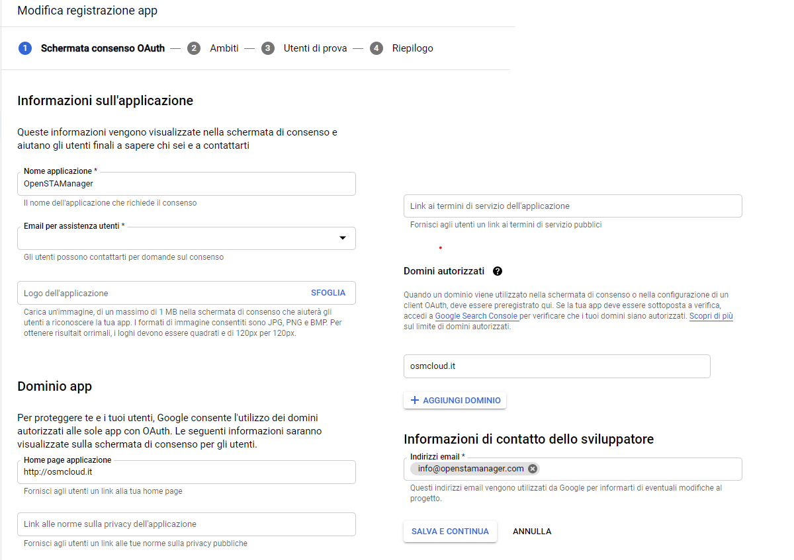
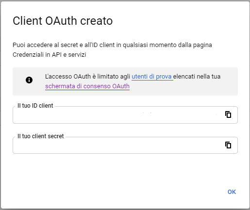

# 📙 OAuth2

A partire dalla versione 2.4.24, il gestionale OpenSTAManager supporta l'autenticazione OAuth2 per l'accesso agli account di posta elettronica attraverso il pannello OAuth2 del modulo **Account email**.

## 📙 Configurazione di OAuth2

.png>)

Per abilitare l'autenticazione OAuth2 per un account email è necessario utilizzare la relativa checkbox **Abilita OAuth2** e selezionare il **Provider** tra quelli disponibili. A seguito di queste azioni, comparirà un link dinamico a questa documentazione che descrive le procedure da utilizzare per ottenere **Client ID e Secret** sulla base del provider selezionato.

### 📙 Google

L'accesso all'account Google tramite OAuth2 richiede la seguente configurazione nel modulo **Account email**:

| **Configurazione IMAP**                                                                                                                     | **Configurazione SMTP**                                                                                                                                                                                      |
| ------------------------------------------------------------------------------------------------------------------------------------------- | ------------------------------------------------------------------------------------------------------------------------------------------------------------------------------------------------------------ |
| <ul><li><strong>Server SMTP</strong>: imap.google.com</li><li><strong>Porta</strong>: 993</li><li><strong>Sicurezza</strong>: SSL</li></ul> | <ul><li><strong>Server</strong>: smtp.gmail.com</li><li><strong>Porta</strong>: 587 / 465</li><li><strong>Sicurezza</strong>: TSL / SSL</li><li><strong>Non verificare il certificato SSL</strong></li></ul> |

La configurazione dell'accesso OAuth2 per account Google si effettua all'indirizzo [https://console.developers.google.com/](https://console.developers.google.com), dove è necessario accedere con l'account interessato.

#### 📙 Creazione progetto

Una volta raggiunta la Google Cloud Platform, si deve procedere a generare un _Nuovo progetto_ appositamente denominato "OpenSTAManager"; in alternativa, se è disponibile un progetto pre-esistente, è possibile utilizzarlo.

.png>)

Dopo la creazione del progetto in questione, nella sezione Credenziali del menù di navigazione laterale è possibile procedere alla generazione della schermata e delle credenziali di accesso OAuth2.

#### 📙 Impostazione schermata OAuth2

Il menu di navigazione laterale permette di accedere alla sezione per la configurazione della Schermata di consenso OAuth: qui è necessario selezionare **User Type** Esterno se non si ha accesso a Google Workspace.

Una volta selezionato il tipo, sarà possibile configurare la schermata più nel dettaglio. Segue un esempio pratico (e incompleto) della configurazione: la parte rilevante per l'utilizzo ai fini del gestionale corrisponde ai **Domini autorizzati**, che devono contenere il dominio di installazione del gestionale. Le altre informazioni sono liberamente impostabili, compresi _Ambiti_ e _Utenti di prova_.

#### 📙 Creazione credenziali

Una volta abilitata la schermata di consenso sopra indicata, è necessario attivare le credenziali di accesso OAuth attraverso l'opzione **Crea credenziali -> ID client OAuth** del menu **Credenziali**.

Segue un esempio di impostazione delle informazioni necessarie per la creazione delle credenziali, dove in particolare nel campo **URI di reindirizzamento autorizzati** è necessario indicare l'indirizzo completo al file **oauth2.php** del gestionale in utilizzo. Nell'esempio, considerando OpenSTAManager disponibile a `https://osmcloud.it/`: `https://osmcloud.it/oauth2.php`.

 (1).png>)

Una volta compilate le informazioni richieste, comparirà una schermata che riferisce **Client ID e Secret**: è necessario copiare i contenuti indicati nei rispettivi campi del modulo **Account email**.

#### 📙 Completamento configurazione

Una volta completati i passaggi precedenti, sarà possibile utilizzare il pulsante Completa configurazione del modulo **Account email** per completare l'inizializzazione dell'account via OAuth2.

### 📙 Microsoft

L'accesso all'account Microsoft tramite OAuth2 richiede la seguente configurazione nel modulo **Account email**:

| **Configurazione IMAP**                                                                                                                      | **Configurazione SMTP**                                                                                                                                                                              |
| -------------------------------------------------------------------------------------------------------------------------------------------- | ---------------------------------------------------------------------------------------------------------------------------------------------------------------------------------------------------- |
| <ul><li><strong>Server</strong>: outlook.office365.com</li><li><strong>Porta</strong>: 993</li><li><strong>Sicurezza</strong>: SSL</li></ul> | <ul><li><strong>Server</strong>: smtp.office365.com</li><li><strong>Porta</strong>: 587</li><li><strong>Sicurezza</strong>: TLS</li><li><strong>Non verificare il certificato SSL</strong></li></ul> |

La configurazione dell'accesso OAuth2 per account Microsoft si effettua all'indirizzo [https://portal.azure.com/](https://portal.azure.com), dove è necessario accedere con l'account interessato.

#### 📙 Registrazione App

Una volta all'interno del portale Azure, si deve navigare alla sezione **Azure Active Directory** dove viene presentata una panoramica dell'account di riferimento. In questa schermata è possibile individuare il campo **ID tenant**, che bisogna copiare per il rispettivo campo nel modulo **Account email**.

Una volta completata l'informazione di cui sopra, è necessario procedere alla registrazione di una applicazione dedicata per il servizio.

Al momento della compilazione delle informazioni, è fondamentale impostare correttamente il campo **URI di reindirizzamento**.

Nell'esempio, considerando OpenSTAManager disponibile in `https://miainstallazione/,`si dovrà inserire:

&#x20;`https://miainstallazione/oauth2.php`.

mentre, se si sta configurando OAuth per l'accesso al gestionale si dovrà inserire:

&#x20;`https://miainstallazione/oauth2_login.php`.

<figure><figcaption></figcaption></figure>

Una volta completato questo passaggio, viene reso disponibile il **Client ID** sotto il nome di **ID applicazione (client)**. La generazione del Client Secret avviene attraverso il menu laterale **Certificati e segreti**, che propone la creazione del segreto tramite il pulsante **Nuovo segreto client**: il **Client Secret** è quindi disponibile sotto il nome **Valore** del nuovo segreto.

.png>)

#### 📙 Autorizzazioni API

La configurazione dell'accesso Microsoft richiede inoltre la gestione delle autorizzazioni sulle informazioni che le credenziali create rendono disponibili. Ciò è possibile dal meni **Autorizzazioni API**, dove è necessario usare il pulsante **Aggiungi un'autorizzazione** e selezionare il provider **Microsoft Graph**.

Per l'utilizzo ai fini di invio email tramite protocollo SMTP, è necessario selezionare `offline_access` e `SMTP.Send.`


Se si sta configurando l'account per l'accesso tramite OAuth, è necessario autorizzare i permessi per User.Read.


#### 📙 Completamento configurazione

Una volta completati i passaggi precedenti, sarà possibile utilizzare il pulsante Completa configurazione del modulo **Account email** per completare l'inizializzazione dell'account via OAuth2

## 📙 Configurazione di un account Microsoft con OAuth2 per l'accesso al gestionale

Dalla versione 2.4.54 è stata introdotta la funzione di autenticazione al gestionale tramite OAuth2 Microsoft. Per poter utilizzare questa procedura è necessario avere un account Microsoft configurato correttamente con OAuth2.


E' possibile configurare un account microsoft per l'accesso con OAuth2 da Strumenti/Tabelle/Accesso con OAuth, non è necessario che l'account sia configurato tra gli account mail.


<figure><figcaption></figcaption></figure>

Sarà qui necessario inserire Client ID e Client Secret, per la loro creazione consulta:

[#microsoft](configurazione-oauth2.md#microsoft "mention")

Il Tenant ID è impostato come _consumers_ di default, se l'utente non è all'interno di un gruppo.

Dopo aver compilato questi valori, è necessario cliccare su Abilita, verrà così abilitato il pulsante in fase di login.


L'username associato all'accesso con OAuth2 deve corrispondere con la mail appena configurata per l'accesso, se corrisponde ad esempio a: test@outlook.com, lo username dovrà essere test@outlook.com



Consigliamo di verificare di aver abilitato i permessi User.Read, e di aver correttamente configurato l'URI di reindirizzamento in /oauth2\_login.php per la corretta gestione del login tramite OAuth2.


**⚙️ Gestione Account**

Per gestire la tua connessione OAuth2, puoi sempre tornare al portale di Azure:

* [https://portal.azure.com/](https://portal.azure.com/)
* Naviga a "Azure Active Directory" > "Registrazioni App" per vedere o modificare la tua app.

**🛠️ Risoluzione problemi**

Se incontri problemi nell'accesso:

* Verifica lo stato del servizio Microsoft Azure per escludere disservizi temporanei.
* Assicurati che l'URI di reindirizzamento sia corretto nella configurazione dell'app registrata in Azure.
* Controlla che il Client Secret non sia scaduto e che le autorizzazioni concesso non siano state revocate.

Seguendo questi passaggi, dovresti essere in grado di accedere al gestionale con il tuo account Microsoft configurato con OAuth2.
