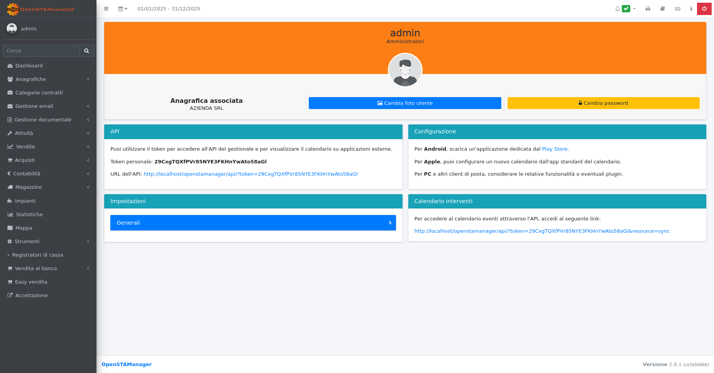

# 📙 API

> Con application programming interface (in acronimo API, in italiano interfaccia di programmazione di un'applicazione), in informatica, si indica ogni insieme di procedure disponibili al programmatore, di solito raggruppate a formare un set di strumenti specifici per l'espletamento di un determinato compito all'interno di un certo programma.
>
> [Wikipedia](https://it.wikipedia.org/wiki/Application_programming_interface)

Il gestionale possiede un sistema di API basilare che permette di ottenere i dati registrati al suo interno attraverso un'interfaccia comune, oltre che di creare e aggiornare le informazioni dei vari record salvati.


Il sistema API del gestionale è attualmente in sviluppo, e pertanto le funzioni disponibili potrebbero essere piuttosto ridotte.

Le informazioni qui descritte sono valida a partire dalla versione 2.4 del gestionale.


### Metodo di accesso

L'accesso all'API viene garantito esclusivamente tramite il token personale di accesso dell'utente, individuabile nella sezione dedicata alle informazioni sull'account.

<figure><figcaption></figcaption></figure>

Cliccando sulla sezione evidenziata in rosso, si apre una pagina dedicata alla visualizzazione delle informazioni personali dell'utente e che permette la modifica della password e della foto profilo, oltre che la visualizzazione del token per l'API.

<figure><figcaption></figcaption></figure>

Nella sezione denominata **API** sono disponibili il token e l'URL per accedere al sistema API del gestionale.

In alternativa, è disponibile la seguente risorsa dedicata per l'accesso direttamente da API.

## Richiesta di accesso

<mark style="color:orange;">`PUT`</mark> `http://localhost/openstamanager/api`

Si ricordi che, come indicato in Modalità di utilizzo, il contenuto della richiesta deve essere formattato come JSON:

`{"resource":"login", "username": "<username>", "password", "<password>"}`

#### Request Body

| Name     | Type   | Description               |
| -------- | ------ | ------------------------- |
| resource | string | Nome della risorsa: login |
| username | string | Username dell'utente      |
| password | string | Password dell'utente      |



```
```



### Gestione degli accessi

E' disponibile un sistema di gestione degli accessi basilare per l'amministratore del gestionale, che può abilitare l'accesso degli utenti attraverso il modulo [**Utenti e permessi**](../openstamanager/modules/strumenti/gestione-accessi/utentiepermessi.md).


Non è al momento disponibile un sistema di permessi per il sistema API, e pertanto chiunque possegga un token può accedere a tutte le informazioni che l'API rende disponibile.


### Messaggi di errore

In base allo stato dell'API e alla richiesta effettuata, è possibile che vengano restituiti dei messaggi di stato che informano l'utilizzatore del risultato della richiesta.

In particolare, sono presenti i seguenti _status_:

* `200: OK` - La richiesta è andata a buon fine.
* `400: Errore interno dell'API` - La richiesta effettuata risulta invalida per l'API.
* `401: Non autorizzato` - Accesso non autorizzato.
* `404: Non trovato` - La risorsa richiesta non risulta disponibile.
* `500: Errore del server` - Il gestionale non è in grado di completare la richiesta.
* `503: Servizio non disponibile` - L'API del gestionale non è abilitata a causa della versione troppo vecchia di MySQL (>= 5.6.5).

### Modalità di utilizzo

Ogni richiesta di comunicazione con l'API deve essere composta di una chiave di accesso e di un'operazione richiesta, e deve essere formattata secondo il formato JSON.

In base al tipo di risorsa che si desidera richiedere, sono disponibili quattro metodi HTTP per la comunicazione:

* `GET`, dedicato alle richieste di informazioni ([**Retrieve**](/broken/pages/-M35Yl-02chw-RFc7m4r)).
* `POST`, dedicato alle richieste di creazione (**Create**).
* `PUT`, dedicato alle richieste di modifica (**Update**).
* `DELETE`, dedicato alle richieste di eliminazione (**Delete**).

Maggiori informazioni sulle relative risorse disponibili sono presenti nelle prossime sezioni, oltre che all'interno della tabella `zz_api_resources` del gestionale.

***

Vai alla documentazione completa delle API di OpenSTAManager:



### Creare una nuova API

OpenSTAManager utilizza un sistema di API REST modulare che permette di esporre funzionalità del gestionale attraverso endpoint HTTP. Il sistema è basato su:

* **Tabella di registrazione**: `zz_api_resources` che contiene la mappatura delle risorse API
* **Classi PHP**: che implementano la logica delle operazioni CRUD
* **Interfacce**: che definiscono i metodi da implementare per ogni tipo di operazione

#### Struttura della tabella zz\_api\_resources

La tabella `zz_api_resources` ha la seguente struttura:

```
CREATE TABLE `zz_api_resources` (
  `id` int(11) NOT NULL AUTO_INCREMENT,
  `version` varchar(15) NOT NULL,
  `type` ENUM('create', 'retrieve', 'update', 'delete'),
  `resource` varchar(255) NOT NULL,
  `class` varchar(255) NOT NULL,
  `enabled` tinyint(1) NOT NULL,
  PRIMARY KEY (`id`)
)
```

#### Campi della tabella:

<table><thead><tr><th width="109">Campo</th><th width="289">Descrizione</th><th>Valori possibili</th></tr></thead><tbody><tr><td><code>version</code></td><td>Versione dell'API</td><td>"v1", "app-v1", "custom"</td></tr><tr><td><code>type</code></td><td>Tipo di operazione supportata</td><td>create, retrieve, update, delete</td></tr><tr><td><code>resource</code></td><td>Nome della risorsa API (endpoint)</td><td>es. "articoli", "anagrafiche"</td></tr><tr><td><code>class</code></td><td>Percorso completo della classe PHP</td><td>es. "Modules\\Articoli\\API\\v1\\Articoli"</td></tr><tr><td><code>enabled</code></td><td>Flag per abilitare/disabilitare</td><td>1=abilitata, 0=disabilitata</td></tr></tbody></table>

#### Passaggi per creare una nuova API

#### 1. Creare la classe PHP

Le classi API devono essere posizionate in una delle seguenti directory:

* **API generiche**: `src/API/` (per API di sistema)
* **API di modulo**: `modules/{nome_modulo}/src/API/v1/` (per API specifiche di un modulo)
* **API per app mobile**: `src/API/App/v1/` (per l'applicazione mobile)

**Struttura base di una classe API:**

```
<?php

namespace Modules\{NomeModulo}\API\v1;
// oppure
namespace API\App\v1;
// oppure
namespace API\Common;

use API\Interfaces\RetrieveInterface;
use API\Interfaces\CreateInterface;
use API\Interfaces\UpdateInterface;
use API\Interfaces\DeleteInterface;
use API\Resource;

class {NomeClasse} extends Resource implements RetrieveInterface, CreateInterface
{
    public function retrieve($request)
    {
        // Logica per la lettura dei dati
        return [
            'table' => 'nome_tabella',
            'select' => ['campo1', 'campo2'],
            'where' => [],
            'order' => [],
        ];
    }

    public function create($request)
    {
        // Logica per la creazione di nuovi record
        $data = $request['data'];
        // ... implementazione
        return ['id' => $nuovo_id];
    }
}
```

#### 2. Implementare le interfacce necessarie

**Interfacce disponibili:**

| Interfaccia         | Operazione           | Metodo richiesto     | HTTP Method |
| ------------------- | -------------------- | -------------------- | ----------- |
| `RetrieveInterface` | Lettura dati         | `retrieve($request)` | GET         |
| `CreateInterface`   | Creazione record     | `create($request)`   | POST        |
| `UpdateInterface`   | Aggiornamento record | `update($request)`   | PUT/PATCH   |
| `DeleteInterface`   | Eliminazione record  | `delete($request)`   | DELETE      |

#### 3. Registrare la risorsa nella tabella zz\_api\_resources

Inserire un record nella tabella per ogni operazione supportata:

```
INSERT INTO `zz_api_resources` (`version`, `type`, `resource`, `class`, `enabled`) VALUES
('v1', 'retrieve', 'mia_risorsa', 'Modules\\MioModulo\\API\\v1\\MiaClasse', 1),
('v1', 'create', 'mia_risorsa', 'Modules\\MioModulo\\API\\v1\\MiaClasse', 1),
('v1', 'update', 'mia_risorsa', 'Modules\\MioModulo\\API\\v1\\MiaClasse', 1),
('v1', 'delete', 'mia_risorsa', 'Modules\\MioModulo\\API\\v1\\MiaClasse', 1);
```

### Esempi pratici

#### Esempio 1: API semplice per lettura dati

```
<?php

namespace Modules\Articoli\API\v1;

use API\Interfaces\RetrieveInterface;
use API\Resource;

class Articoli extends Resource implements RetrieveInterface
{
    public function retrieve($request)
    {
        return [
            'table' => 'mg_articoli',
            'select' => [
                'mg_articoli.*',
                'categorie.nome AS categoria'
            ],
            'joins' => [
                [
                    'mg_categorie AS categorie',
                    'mg_articoli.id_categoria',
                    'categorie.id'
                ]
            ],
            'where' => [
                ['mg_articoli.deleted_at', '=', null]
            ],
            'order' => ['mg_articoli.id' => 'ASC']
        ];
    }
}
```

#### Esempio 2: API completa con CRUD

```
<?php

namespace Modules\Anagrafiche\API\v1;

use API\Interfaces\CreateInterface;
use API\Interfaces\DeleteInterface;
use API\Interfaces\RetrieveInterface;
use API\Interfaces\UpdateInterface;
use API\Resource;
use Modules\Anagrafiche\Anagrafica;

class Anagrafiche extends Resource implements RetrieveInterface, CreateInterface, UpdateInterface, DeleteInterface
{
    public function retrieve($request)
    {
        return [
            'table' => 'an_anagrafiche',
            'select' => [
                'an_anagrafiche.*',
                'an_nazioni.nome AS nazione'
            ],
            'joins' => [
                [
                    'an_nazioni',
                    'an_anagrafiche.id_nazione',
                    'an_nazioni.id'
                ]
            ],
            'where' => [
                ['an_anagrafiche.deleted_at', '=', null]
            ]
        ];
    }

    public function create($request)
    {
        $data = $request['data'];
        $anagrafica = Anagrafica::build($data['ragione_sociale'], $data['tipo']);

        // Aggiornamento campi
        $anagrafica->partita_iva = $data['partita_iva'] ?? '';
        $anagrafica->codice_fiscale = $data['codice_fiscale'] ?? '';
        $anagrafica->save();

        return ['id' => $anagrafica->id];
    }

    public function update($request)
    {
        $data = $request['data'];
        $anagrafica = Anagrafica::find($data['id']);

        $anagrafica->ragione_sociale = $data['ragione_sociale'];
        $anagrafica->partita_iva = $data['partita_iva'] ?? '';
        $anagrafica->save();

        return [];
    }

    public function delete($request)
    {
        $id = $request['id'];
        $anagrafica = Anagrafica::find($id);
        $anagrafica->delete();
    }
}
```

### Registrazione nel database

Per registrare le API dell'esempio precedente:

```
-- API per Articoli (solo lettura)
INSERT INTO `zz_api_resources` (`version`, `type`, `resource`, `class`, `enabled`) VALUES
('v1', 'retrieve', 'articoli', 'Modules\\Articoli\\API\\v1\\Articoli', 1);

-- API per Anagrafiche (CRUD completo)
INSERT INTO `zz_api_resources` (`version`, `type`, `resource`, `class`, `enabled`) VALUES
('v1', 'retrieve', 'anagrafiche', 'Modules\\Anagrafiche\\API\\v1\\Anagrafiche', 1),
('v1', 'create', 'anagrafica', 'Modules\\Anagrafiche\\API\\v1\\Anagrafiche', 1),
('v1', 'update', 'anagrafica', 'Modules\\Anagrafiche\\API\\v1\\Anagrafiche', 1),
('v1', 'delete', 'anagrafica', 'Modules\\Anagrafiche\\API\\v1\\Anagrafiche', 1);
```

### Note importanti

**Naming convention:**

* Per operazioni su collezioni: usa il plurale (es. "articoli", "anagrafiche")
* Per operazioni su singoli elementi: usa il singolare (es. "articolo", "anagrafica")

**Versioning:**

* Usa "v1" per API standard
* Usa "app-v1" per API dedicate all'app mobile
* Usa "custom" per API personalizzate

