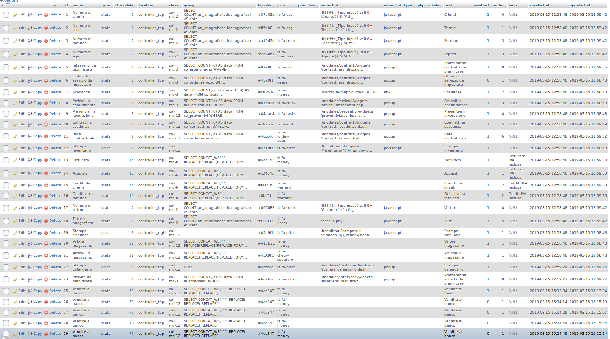

# Widget


I **Widget** sono strumenti utili nell'utilizzo di OpenSTAManager, sono presenti in diversi moduli, ognuno con una funzionalità differenti.

Grazie all'immagine sottostante andremo a darne uno sguardo più tecnico.


Questi sono i **widgets** che offre OpenSTAManager, presenti dentro la tabella **zz\_widgets.**

Ogni **Widget** è composto da:

* **id:** numero progressivo assegnato.
* **name:** nome dato al **widget** nel database.
* **type:** può essere stats,chart,custom o print. I due utilizzati sono **stats,** per restituire dei valori testuali e numerici, **print** quando è un **widget** finalizzato alla stampa.
* **id\_module:** indica a quale modulo si riferisce.
* **location:** dove è situato nella pagina, se **controller\_top** sopra, se **controller\_right** sotto.
* **class:** determina la grandezza del **widget** nella pagina.
* **query:** la richiesta che deve fare al DB per visualizzare un determinato dato.
* **bg color:** parametri che indicano il colore del **widget**.
* **icon:** l'icona del **widget**.
* **more\_link\_type**: javascript,popup o link. Se javascript va ad applicare un filtro alla ricerca, se popup fa visualizzare una finestra con un messaggio, se link rimanda ad un modulo.
* **more\_link:** dipende dal more\_link\_type. Se javascript è presente un codice javascript che svolge una determinata azione, se popup o link richiama un file .php.
* **text:** il nome del widget visualizzato nel gestionale.
* **enable:** se 1 il widget è attivo, se a 0 il **widget** è disattivato.
* **order:** indica l'ordine nel quale i **widget** sono visualizzati nel modulo in questione. Se **\*\*un** widget\*\* viene spostato questo numero cambia.
* **help:** il messaggio che viene visualizzato passando sopra al **widget** con il mouse.
* **created\_at:** giorno,mese e ora di quando è stato creato.
* **updated\_at:** giorno,mese e ora di quando è stato caricato.
