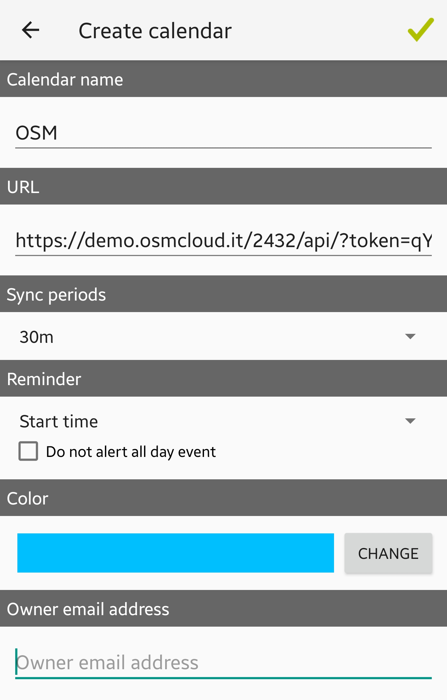

# Calendario su telefono

### 📱 Sistema Android

L'importazione del calendario attività su sistema Android è possibile tramite l'app iCalSync, scaricabile da playstore ([https://play.google.com/store/search?q=iCalSync\&c=apps](https://play.google.com/store/search?q=iCalSync\&c=apps)).

Per prima cosa si dovrà risalire all'API token, visualizzabile dalla schermata che si presenterà cliccando sul nome dell'azienda, sotto calendario interventi.

.png>)

 (1) (1).png>)


L'API corretto è quello nella sezione di destra: Calendario interventi. Copiando l'API nella sezione API la procedura non andrà a buon fine.


Si dovrà ora lanciare l'app iCalSync appena scaricata e la schermata che si presenterà sarà questa, dove si andranno ad inserire il nome del calendario, l'API token e la frequenza di sincronizzazione.

&#x20;                                                                 

Andando ora ad aprire il calendario si potranno vedere gli interventi registrati sulla dashboard.

 (1) (1).png>)

&#x20;                                                          

Il calendario si sincronizzerà ogni 30 minuti come preimpostato, per forzare la sincronizzazione di un'attività appena creata in dashboard basterà premere sul calendario OSM dentro l'app.

 (1) (1).png>)

.jpg>)

## 📱 Sistema iOS

Con sistema iOS si può configurare un nuovo calendario dall'app standard del calendario.
