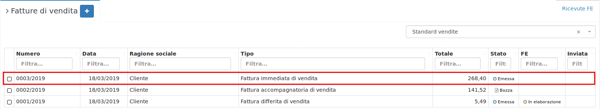
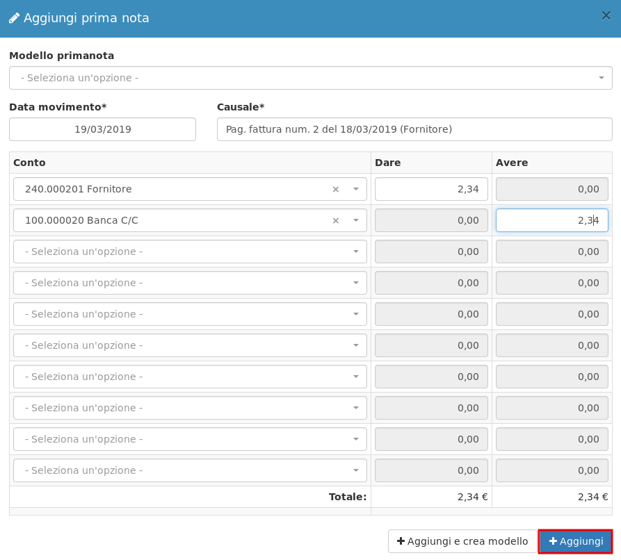
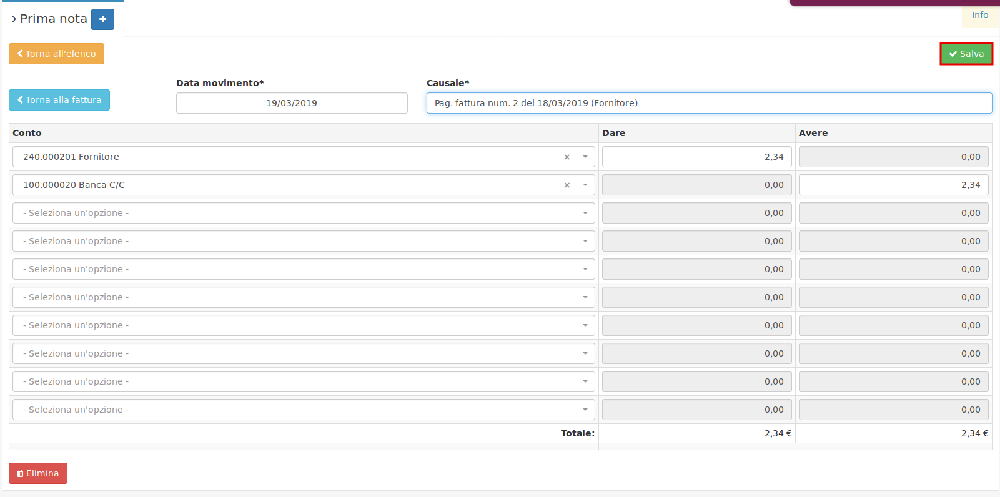
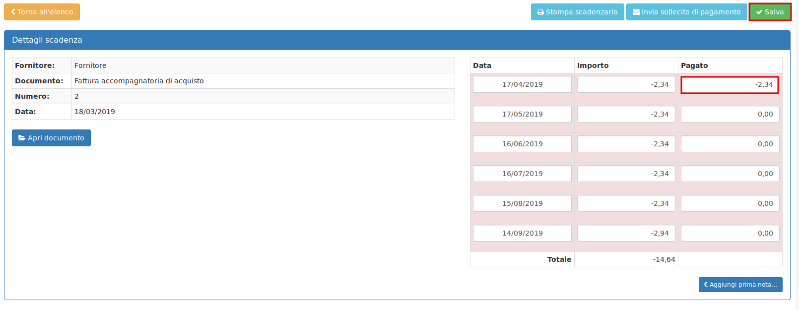

# Incassi e pagamenti

OpenSTAManager permette di tenere traccia dei pagamenti scaduti e da effettuare attraverso il modulo **Scadenzario,** è presente sotto la voce **Contabilità** nel menu laterale di OpenSTAManager.

### Visualizzazione scadenze

Aprendo il modulo **Scadenzario** è possibile vedere le **Fatture di acquisto** e le **Fattura di vendita** in stato **Emessa**, suddivise per le scadenze relativamente registrate**.**

Esempio: creo un **Fattura di vendita** inserendo come pagamento **Bonifico 30/60/90/120gg d.f.** mettendola in stato di **Emessa,** nello **Scadenzario** vedrò questa fattura con **Data emissione,** il giorno, mese e anno di quando ho emesso la fattura e come **Data scadenza** le diverse scadenze del pagamento specificato precedentemente.

### Chiudere una fattura

Quando la **Fattura di vendita** è stata pagata dal cliente, per non visualizzarla più nello **Scadenzario** si possono adottare **3** metodi differenti:

#### 1. Con prima nota \(consigliato\)

Quando una **fattura** è stata pagata è possibile toglierla dallo **Scadenzario** cliccando sopra al record e successivamente cliccando il tasto  , dove apparirà questa schermata:

Cliccando su  andrò ad aggiungere il movimento in prima nota:

Così facendo la **fattura** non sarà presente nello **Scadenzario** e sarà visibile il movimento in **Prima nota.**

#### 2. Da scadenzario

Quando una **fattura** è stata pagata o parzialmente pagata è possibile toglierla dallo **Scadenzario** cliccando sopra al record e andando ad inserire in **Pagato** quanto il cliente ha pagato e successivamente cliccare su  . Esempio:

#### 3. Cambiando solamente lo stato

Quando una **fattura** è stata pagata è possibile toglierla dallo **Scadenzario** cambiando lo stato della fattura da **Emessa** a **Pagato.** Esempio:

### Caratteristiche

Al momento nello **Scadenzario** sono presenti sia le **Fatture di acquisto** sia le **Fatture di vendita.** Le fatture con importo **positivo** sono **Fatture di vendita,** le fatture con importo **negativo** sono **Fatture di acquisto.** Nelle prossime versioni è prevista la divisione dello **Scadenzario** in **Scadenzario Fatture di vendita** e **Scadenzario Fatture di acquisto.**

Per tenere traccia dei pagamenti scaduti e da effettuare è necessario filtrare la ricerca andando ad inserire in **Data scadenza** mese e anno, nel seguente formato: mese/anno es. 02/2019. Cosi' facendo vedrò i pagamenti scaduti e da effettuare nel mese e anno selezionato. Il filtraggio può essere fatto anche solo digitando l'anno es: 2018.


I pagamenti scaduti e da effettuare che vanno oltre la **Data di scadenza** saranno visualizzati in **rosso.**


### Stampa

Il gestionale offre anche delle opzioni di **stampa**, presenti sotto la tabella, quali:

* **Stampa scadenzario:** effettua la stampa di tutti i record presenti nello scadenzario.
* **Scadenzario clienti:** effettua la stampa dei clienti quindi delle **Fatture di vendita**.
* **Scadenzario fornitori**: effettua la stampa dei fornitori quindi delle **Fatture di acquisto.**


Se si filtra la ricerca nello **Scadenzario** la stampa visualizzerà solo i record filtrati.


