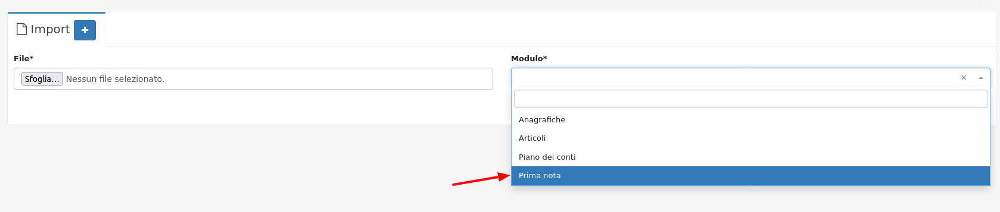

# Decreto Rilancio 2020


Come aggiungere lo sconto nella fattura elettronica per i bonus 110/65/50 %?


Esempio:

Intervento agevolabile ai fini del superbonus del 110% per 30.000,00 €.\
Sconto accordato di 10.000,00 €.

Per aggiungere il relativo sconto nella fattura elettronica la prima cosa da fare è entrare nella schermata di modifica della fattura (**Vendite->Fatture di vendita)** e cliccare sul pulsante **attributi avanzati** nella riga dell'articolo che beneficia del bonus.

Da qui bisogna inserire nel campo **Riferimento Testo** la seguente dicitura: \*\* **\_**"\*\*Sconto praticato in base all'art. 121 del DL n.34 del 2020".\_

Infine per inserire lo sconto effettivo basta inserire la percentuale o l'importo dello sconto finale sul campo corrispondente nella schermata di **modifica** della fattura.

Una volta emessa la **fattura** il calcolo delle scadenze verrà effettuato considerando lo sconto applicato.
