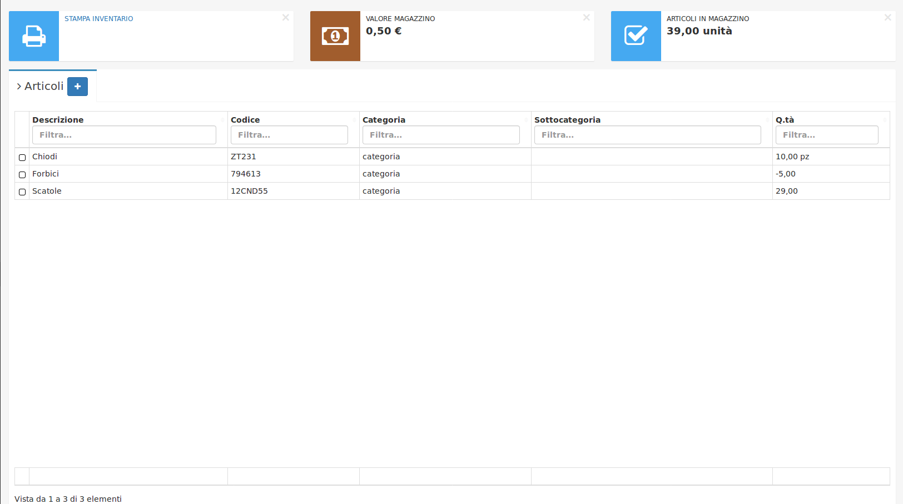

# Magazzino

## Inventario


Come allineare le quantità di **Magazzino**?


Può capitare, non potendo avere sempre alla mano tutti gli articoli presenti nel **Magazzino** di avere alcuni articoli con quantità negativa, come sistemare queste quantità?

Nell'immagine soprastante è possibile vedere che l'articolo con **Descrizione** forbici presenta una **Q.tà** negativa, -5,00. Per allineare la quantità è necessario cliccare sopra il _record,_ apparirà questa schermata:

Andando giù con il cursore troveremo la sezione **Giacenza** **totale** dove il campo **Quantità** è bloccato e quindi impossibile da modificare. Per modificarlo è necessario fare la spunta su **Modifica quantità**:

Così facendo è possibile modificare la **Quantità,** inoltre, viene aggiunto in automatico dal gestionale il campo obbligatorio **Descrizione movimento,** dove si deve inserire una piccola descrizione, e **Data movimento** dove si può andare a specificare una **Data** legata al movimento. Dopo aver modificato la **Quantità** e una descrizione premere il tasto **Salva** per portare le modifiche desiderate.

Ora la **Quantità** di forbici non è più -5,00 ma 15,00, cioè la cifra inserita precedentemente.

Nella modulo **Movimenti** è possibile vedere il movimento che abbiamo appena eseguito per allineare un **articolo** in **Magazzino**

In alternativa è possibile aggiungere un movimento tramite il pulsante standard **+,** in cui si andranno a specificare i seguenti campi:

* **Articolo**
* **Quantità**
* **Data**
* **Causale** (Carico, Scarico, Spostamento tra magazzini)
* **Descrizione movimento**
* **Partenza merce**
* **Destinazione merce**

## Articolo fittizio


Nel caso in cui serva aggiungere un servizio, come ad esempio le spese di spedizione, ma non troviamo alcuna opzione che ci permetta di aggiungerlo, possiamo farlo utilizzando il modulo **Articolo.**


Il procedimento è uguale a quello di **Creazione** di un **Articolo** ma bisogna avere l'accortezza di spuntare, nella sezione **Vendita**, il campo **Questo articolo è un servizio,** specificandi il **Prezzo di vendita**:

Spuntando la casella **Questo articolo è un servizio** le quantità non saranno considerate, in questo modo rimangono fisse a **0** mentre il **Prezzo di vendita** è il prezzo stabilito per il servizio.

Grazie alla possibilità di aggiungere un articolo fittizio posso per esempio aggiungere le spese di spedizione in un **Ddt in uscita.**
