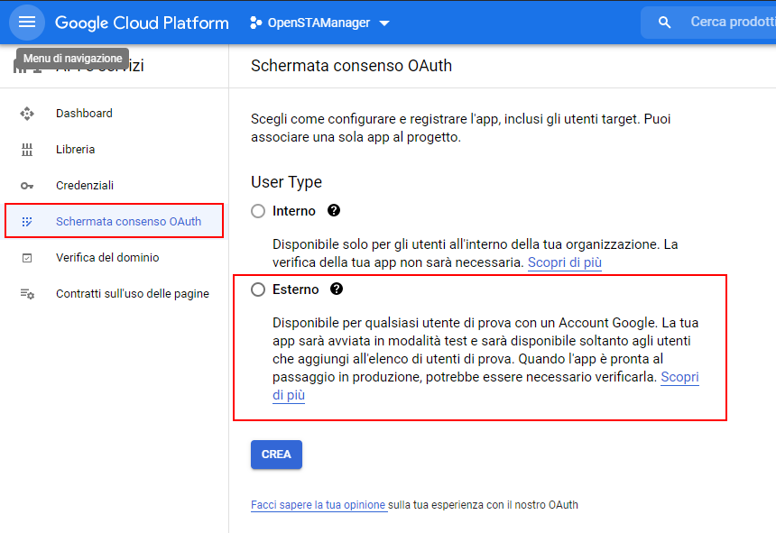
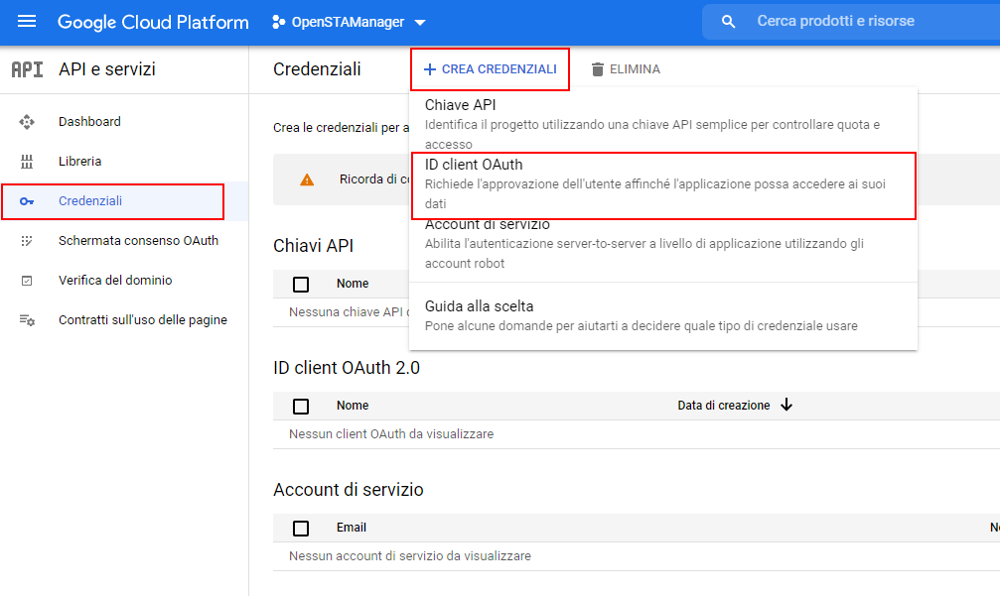
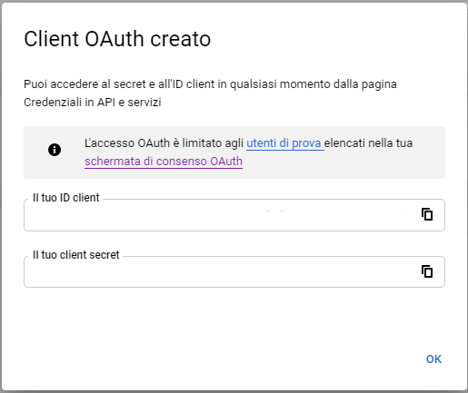
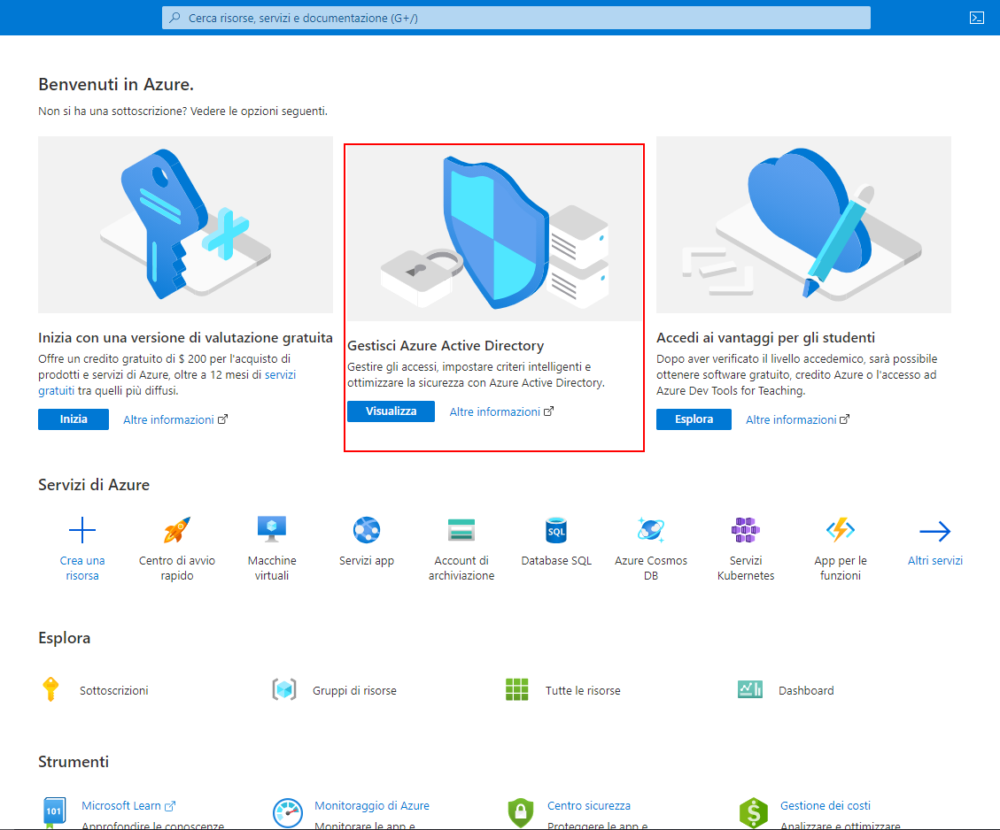
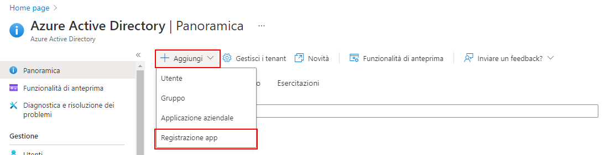
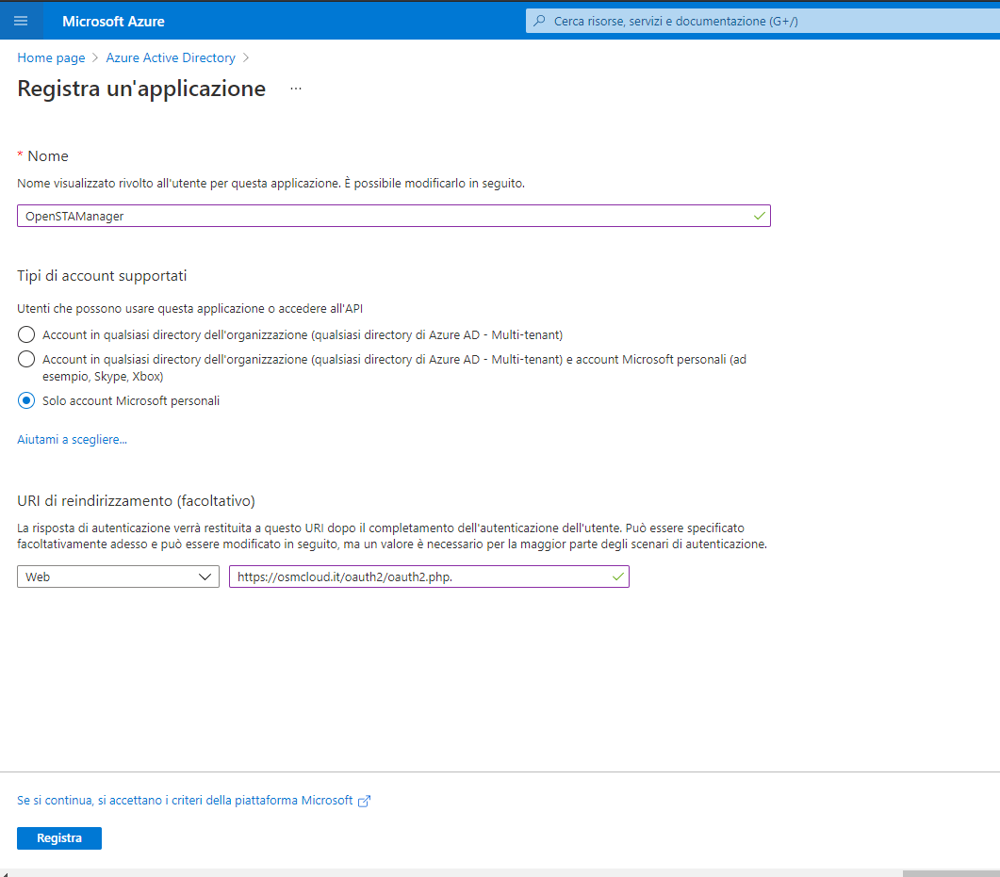
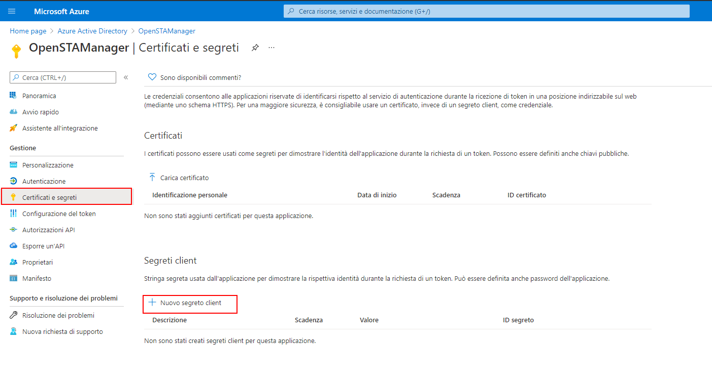
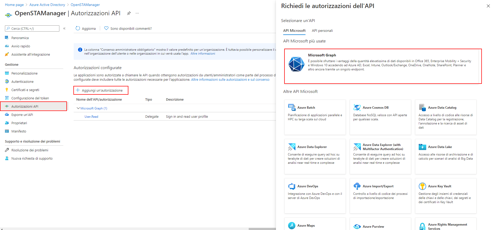

# Configurazione OAuth2

A partire dalla versione 2.4.24, il gestionale OpenSTAManager supporta  l'autenticazione OAuth2 per l'accesso agli account di posta elettronica attraverso il pannello OAuth2 del modulo **Account email**.

Per abilitare l'autenticazione OAuth2 per un account email è necessario utilizzare la relativa checkbox _Abilita OAuth2_ e selezionare il _Provider_ tra quelli disponibili. A seguito di queste azioni, comparirà un link dinamico a questa documentazione che descrive le procedure da utilizzare per ottenere **Client ID e Secret** sulla base del provider selezionato.

## Google

L'accesso all'account Google tramite OAuth2 richiede la seguente configurazione:

* **Server SMTP**: imap.google.com 
* **Porta SMTP**: 993
* **Sicurezza SMTP**: ssl

### Creazione progetto

Per ottenere le chiavi di accesso Client ID e Secret, è necessario quindi accedere all'indirizzo [https://console.developers.google.com/](https://console.developers.google.com/). Dall'interfaccia disponibili si procede quindi a generare un Nuovo progetto appositamente denominato "OpenSTAManager"; in alternativa, se è disponibile un progetto pre-esistente, è possibile utilizzarlo.

Dopo la creazione del progetto in questione, nella sezione Credenziali del menù di navigazione laterale è possibile procedere alla generazione della schermata e delle credenziali di accesso OAuth2.

### Impostazione schermata OAuth2

Il menu di navigazione laterale permette di accedere alla sezione per la configurazione della Schermata di consenso OAuth: qui è necessario selezionare **User Type** Esterno se non si ha accesso a Google Workspace.

Una volta selezionato il tipo, sarà possibile configurare la schermata più nel dettaglio. Segue un esempio pratico \(e incompleto\) della configurazione: la parte rilevante per l'utilizzo ai fini del gestionale corrisponde ai **Domini autorizzati**, che devono contenere il dominio di installazione del gestionale. Le altre informazioni sono liberamente impostabili, compresi _Ambiti_ e _Utenti di prova_.

### Creazione credenziali

Una volta abilitata la schermata di consenso sopra indicata, è necessario attivare le credenziali di accesso OAuth attraverso l'opzione **Crea credenziali -&gt; ID client OAuth** del menu **Credenziali**.

Segue un esempio di impostazione delle informazioni necessarie per la creazione delle credenziali, dove in particolare nel campo **URI di reindirizzamento autorizzati** è necessario indicare l'indirizzo completo al file **oauth2.php** del gestionale in utilizzo. Nell'esempio, considerando OpenSTAManager disponibile a `https://osmcloud.it/oauth2/`: `https://osmcloud.it/oauth2/oauth2.php`.

Una volta compilate le informazioni richieste, comparirà una schermata che riferisce **Client ID e Secret**: è ****necessario copiare i contenuti indicati nei rispettivi campi del modulo **Account email**.

### Completamento configurazione

Una volta completati i passaggi precedenti, sarà possibile utilizzare il pulsante Completa configurazione del modulo **Account email** per completare l'inizializzazione dell'account via OAuth2.

## Microsoft

L'accesso all'account Microsoft tramite OAuth2 richiede la seguente configurazione:

* **Server SMTP**: outlook.office365.com
* **Porta SMTP**: 993
* **Sicurezza SMTP**: ssl

### Registrazione App

Per ottenere le chiavi **Client ID e Secret**, è necessario accedere con l'account interessato all'indirizzo [ https://portal.azure.com/](%20https://portal.azure.com/). Una volta all'interno del portale Azure, si deve navigare alla sezione **Azure Active Directory** e procedere a registrare una nuova applicazione a cui garantire l'accesso.

Al momento della compilazione delle informazioni, è fondamentale impostare correttamente il campo **URI di reindirizzamento**. Nell'esempio, considerando OpenSTAManager disponibile a `https://osmcloud.it/oauth2/`: `https://osmcloud.it/oauth2/oauth2.php`.

Una volta completato questo passaggio, viene reso disponibile il **Client ID** sotto il nome di **ID applicazione \(client\)**. La generazione del Client Secret avviene attraverso il menu laterale **Certificati e segreti**, che propone la creazione del segreto tramite il pulsante **Nuovo segreto client**: il **Client Secret** è quindi disponibile sotto il nome **ID segreto**.

### Autorizzazioni API

La configurazione dell'accesso Microsoft richiede inoltre la gestione delle autorizzazioni sulle informazioni che le credenziali create rendono disponibili. Ciò è possibile dal meni **Autorizzazioni API**, dove è necessario usare il pulsante **Aggiungi un'autorizzazione** e selezionare il provider **Microsoft Graph**.

Per l'utilizzo ai fini di invio email tramite protocollo SMTP, è necessario selezionare `offline_access` e `SMTP.Send.`

### Completamento configurazione

Una volta completati i passaggi precedenti, sarà possibile utilizzare il pulsante Completa configurazione del modulo **Account email** per completare l'inizializzazione dell'account via OAuth2.

## Problemi noti

