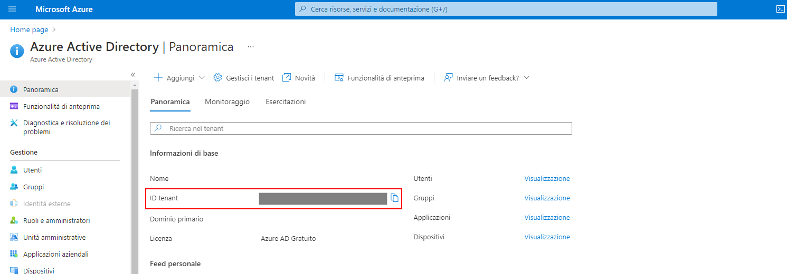

# Configurazione OAuth2

A partire dalla versione 2.4.24, il gestionale OpenSTAManager supporta l'autenticazione OAuth2 per l'accesso agli account di posta elettronica attraverso il pannello OAuth2 del modulo **Account email**.

.png>)

Per abilitare l'autenticazione OAuth2 per un account email è necessario utilizzare la relativa checkbox **Abilita OAuth2** e selezionare il **Provider** tra quelli disponibili. A seguito di queste azioni, comparirà un link dinamico a questa documentazione che descrive le procedure da utilizzare per ottenere **Client ID e Secret** sulla base del provider selezionato.

## Google

L'accesso all'account Google tramite OAuth2 richiede la seguente configurazione nel modulo **Account email**:

| **Configurazione IMAP**                                                                                                                     | **Configurazione SMTP**                                                                                                                                                                                      |
| ------------------------------------------------------------------------------------------------------------------------------------------- | ------------------------------------------------------------------------------------------------------------------------------------------------------------------------------------------------------------ |
| <ul><li><strong>Server SMTP</strong>: imap.google.com</li><li><strong>Porta</strong>: 993</li><li><strong>Sicurezza</strong>: SSL</li></ul> | <ul><li><strong>Server</strong>: smtp.gmail.com</li><li><strong>Porta</strong>: 587 / 465</li><li><strong>Sicurezza</strong>: TSL / SSL</li><li><strong>Non verificare il certificato SSL</strong></li></ul> |

La configurazione dell'accesso OAuth2 per account Google si effettua all'indirizzo [https://console.developers.google.com/](https://console.developers.google.com), dove è necessario accedere con l'account interessato.

### Creazione progetto

Una volta raggiunta la Google Cloud Platform, si deve procedere a generare un _Nuovo progetto_ appositamente denominato "OpenSTAManager"; in alternativa, se è disponibile un progetto pre-esistente, è possibile utilizzarlo.

.png>)

Dopo la creazione del progetto in questione, nella sezione Credenziali del menù di navigazione laterale è possibile procedere alla generazione della schermata e delle credenziali di accesso OAuth2.

### Impostazione schermata OAuth2

Il menu di navigazione laterale permette di accedere alla sezione per la configurazione della Schermata di consenso OAuth: qui è necessario selezionare **User Type** Esterno se non si ha accesso a Google Workspace.

Una volta selezionato il tipo, sarà possibile configurare la schermata più nel dettaglio. Segue un esempio pratico (e incompleto) della configurazione: la parte rilevante per l'utilizzo ai fini del gestionale corrisponde ai **Domini autorizzati**, che devono contenere il dominio di installazione del gestionale. Le altre informazioni sono liberamente impostabili, compresi _Ambiti_ e _Utenti di prova_.

.png>)

### Creazione credenziali

Una volta abilitata la schermata di consenso sopra indicata, è necessario attivare le credenziali di accesso OAuth attraverso l'opzione **Crea credenziali -> ID client OAuth** del menu **Credenziali**.

Segue un esempio di impostazione delle informazioni necessarie per la creazione delle credenziali, dove in particolare nel campo **URI di reindirizzamento autorizzati** è necessario indicare l'indirizzo completo al file **oauth2.php** del gestionale in utilizzo. Nell'esempio, considerando OpenSTAManager disponibile a `https://osmcloud.it/`: `https://osmcloud.it/oauth2.php`.

 (1).png>)

Una volta compilate le informazioni richieste, comparirà una schermata che riferisce **Client ID e Secret**: è \*\*\*\* necessario copiare i contenuti indicati nei rispettivi campi del modulo **Account email**.

### Completamento configurazione

Una volta completati i passaggi precedenti, sarà possibile utilizzare il pulsante Completa configurazione del modulo **Account email** per completare l'inizializzazione dell'account via OAuth2.

## Microsoft

L'accesso all'account Microsoft tramite OAuth2 richiede la seguente configurazione nel modulo **Account email**:

| **Configurazione IMAP**                                                                                                                      | **Configurazione SMTP**                                                                                                                                                                              |
| -------------------------------------------------------------------------------------------------------------------------------------------- | ---------------------------------------------------------------------------------------------------------------------------------------------------------------------------------------------------- |
| <ul><li><strong>Server</strong>: outlook.office365.com</li><li><strong>Porta</strong>: 993</li><li><strong>Sicurezza</strong>: SSL</li></ul> | <ul><li><strong>Server</strong>: smtp.office365.com</li><li><strong>Porta</strong>: 587</li><li><strong>Sicurezza</strong>: TLS</li><li><strong>Non verificare il certificato SSL</strong></li></ul> |

La configurazione dell'accesso OAuth2 per account Microsoft si effettua all'indirizzo [https://portal.azure.com/](https://portal.azure.com), dove è necessario accedere con l'account interessato.

### Registrazione App

Una volta all'interno del portale Azure, si deve navigare alla sezione **Azure Active Directory** dove viene presentata una panoramica dell'account di riferimento. In questa schermata è possibile individuare il campo **ID tenant**, che bisogna copiare per il rispettivo campo nel modulo **Account email**.

Una volta completata l'informazione di cui sopra, è necessario procedere alla registrazione di una applicazione dedicata per il servizio.

Al momento della compilazione delle informazioni, è fondamentale impostare correttamente il campo **URI di reindirizzamento**. Nell'esempio, considerando OpenSTAManager disponibile a `https://osmcloud.it/oauth2/`: `https://osmcloud.it/oauth2/oauth2.php`.

Una volta completato questo passaggio, viene reso disponibile il **Client ID** sotto il nome di **ID applicazione (client)**. La generazione del Client Secret avviene attraverso il menu laterale **Certificati e segreti**, che propone la creazione del segreto tramite il pulsante **Nuovo segreto client**: il **Client Secret** è quindi disponibile sotto il nome **Valore** del nuovo segreto.

.png>)

### Autorizzazioni API

La configurazione dell'accesso Microsoft richiede inoltre la gestione delle autorizzazioni sulle informazioni che le credenziali create rendono disponibili. Ciò è possibile dal meni **Autorizzazioni API**, dove è necessario usare il pulsante **Aggiungi un'autorizzazione** e selezionare il provider **Microsoft Graph**.

Per l'utilizzo ai fini di invio email tramite protocollo SMTP, è necessario selezionare `offline_access` e `SMTP.Send.`

### Completamento configurazione

Una volta completati i passaggi precedenti, sarà possibile utilizzare il pulsante Completa configurazione del modulo **Account email** per completare l'inizializzazione dell'account via OAuth2.

## Problemi noti
