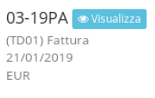

# 📘 Fatturazione Elettronica

## Introduzione


La fatturazione elettronica è un sistema **digitale** di **emissione**, **trasmissione** e **conservazione** delle fatture. Questo significa che non servirà più stampare e conservare la versione cartacea delle fatture, ma basterà generare un file XML con determinate caratteristiche, e dovrà essere inviato al **Sistema Di Interscambio** (SDI), un sistema di smistamento e archiviazione fatture elettroniche gestito dall’**Agenzia Entrate**.


Dal 1° gennaio 2019, la fattura elettronica è obbligatoria fra privati, ossia fra aziende titolari di partita IVA, ad eccezione di alcune categorie particolari di contribuenti.

## Navigazione

Il plugin è raggiungibile dopo la normale creazione di una fattura, dall'interno del documento è necessario aprire il plugin "Fatturazione Elettronica".

## Funzionamento

Per l'invio delle fatture elettroniche è necessario creare le fatture normalmente dal modulo **Fatture di vendita**, cambiarle in stato **Emessa** e salvarle. Dopo di che, dal plugin in alto a destra **Fatturazione elettronica,** va premuto _genera_ per generare la fattura elettronica ed infine _invia_. L'invio restituirà un messaggio di fattura inviata correttamente.

Dopo l'invio della fattura, cambierà lo stato in **elaborazione** nella vista principale delle fatture


Le ricevute di consegna delle **Fatture elettroniche** non sono immediate, serve verificare che la fattura sia stata ricevuta correttamente cercando le ricevute dopo qualche, o il giorno successivo dell'invio. Per cercare le ricevute e aggiornare gli stati delle **Fatture di vendita**, dalla lista delle fatture di vendita, si deve cliccare in alto a destra sul plugin **Ricevute** **FE.**


In questo modo il gestionale verificherà la presenza di ricevute. Se vengo rilevate delle ricevute da importare basterà confermare l'importazione aggiornando così lo stato delle **Fatture di vendita.**

### **Stati**

Gli stati possono essere:

* **In elaborazione:** la fattura è in transito dal gestionale al SDI(Sistema Di Interscambio) dell'Agenzia delle Entrate
* **Consegnata:** la fattura è arrivata a destinazione al cliente
* **Scartata:** la fattura è stata scartata perché contiene degli errori. Aprendo la rispettiva fattura e cliccando sul plugin **Fatturazione elettronica**, è possibile leggere lo stato dell'errore. **IN QUESTO CASO NON VA EMESSA UNA NOTA DI CREDITO PER ANNULLARE LA FATTURA, MA VA INVIATA NUOVAMENTE CON LE DOVUTE CORREZIONI.**
* **Mancata consegna:** la fattura risulta inviata all'Agenzia delle Entrate, ma il ricevente non ha definito un canale tramite cui riceverla, per cui la visualizzerà solo accedendo al proprio cassetto fiscale. Questo caso è **frequente** nel caso di invio **fatture elettroniche** a persone fisiche o per aziende che non hanno definito un canale di ricezione. In questi casi, è necessario/consigliato inviare una copia di cortesia via mail o su supporto cartaceo per informare dell'invio della fattura elettronica
* **Accettata**(solo Pubblica Amministrazione): significa che la fattura è stata consegnata e che il ricevente ha accettato i dati in essa contenuti.
* \*\*Rifiutata(\*\*solo Pubblica Amministrazione): significa che la fattura è stata consegnata ma il ricevente non ha accettato i dati in essa contenuti. **IN QUESTO CASO NON VA EMESSA UNA NOTA DI CREDITO PER ANNULLARE LA FATTURA, MA VA INVIATA NUOVAMENTE CON LE DOVUTE CORREZIONI**

### Fatture passive


Per scaricare le fatture passive dai fornitori, è necessario aprire il modulo [**Acquisti**](../../modules/acquisti/)\*\*,\*\*andare su **Fatture di acquisto** e cliccare in alto a destra su **Fatturazione elettronica**. Nella sezione **Fatture da importare** sarà presente una lista di file XML con un tasto **importa** a fianco, il quale permette di importare le **Fatture passive** con un passaggio intermedio. E' possibile visualizzare un'anteprima delle fatture passive cliccando sul tasto di **Visualizza**


Per completare l'importazione, gli unici dati obbligatori sono quelli contrassegnati con un asterisco, quindi:

* Tipo fattura
* Pagamento
* Dati contabili( IVA e conto). Il conto è soggettivo. Nel dubbio, scegliere **spese varie** se non si sta tenendo la contabilità interna.

### Particolarità


**ATTENZIONE:** Quando emetto una **Fattura** per le **PA** devo verificare di aver inserito il **codice fiscale** nella rispettiva **Anagrafica,** altrimenti, all'invio della fattura,comparirà il seguente errore: **00305-1.4.1.1.2 IdCodice non valido**.


### Automatismi

In fase di importazione di una fattura elettronica, è possibile selezionare quali righe convertire in articolo di magazzino, dopo aver spuntato _Creazione automatica articoli_.

.png>)
