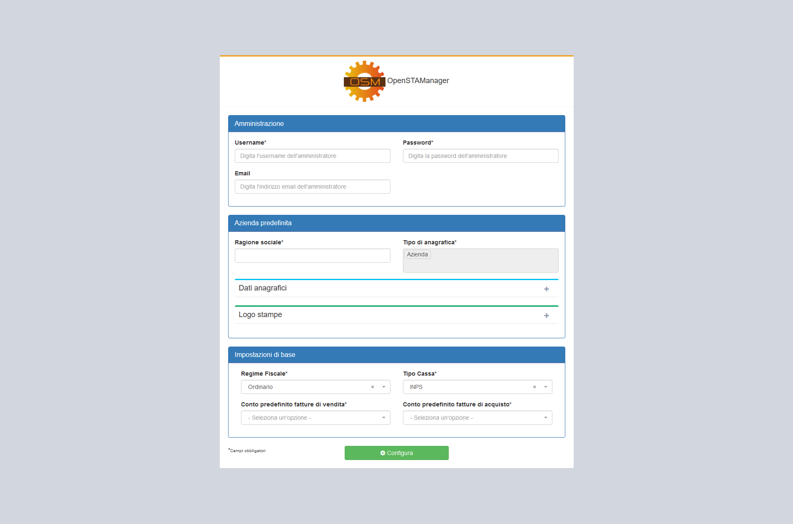
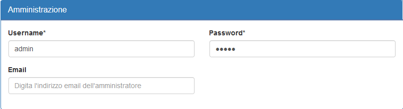
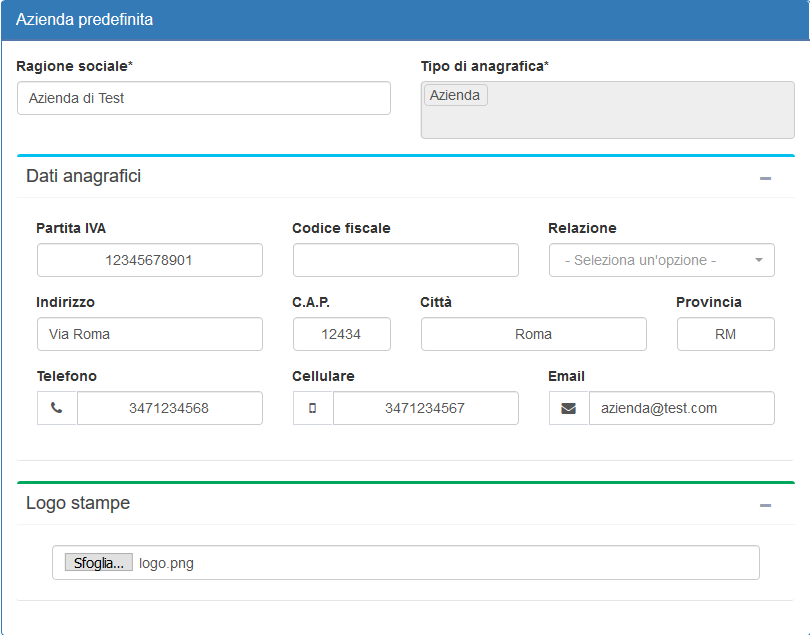
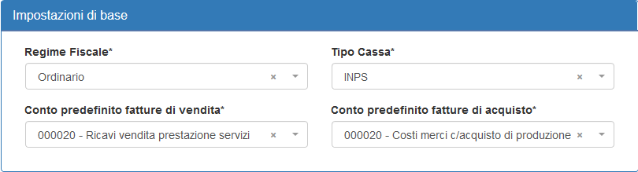
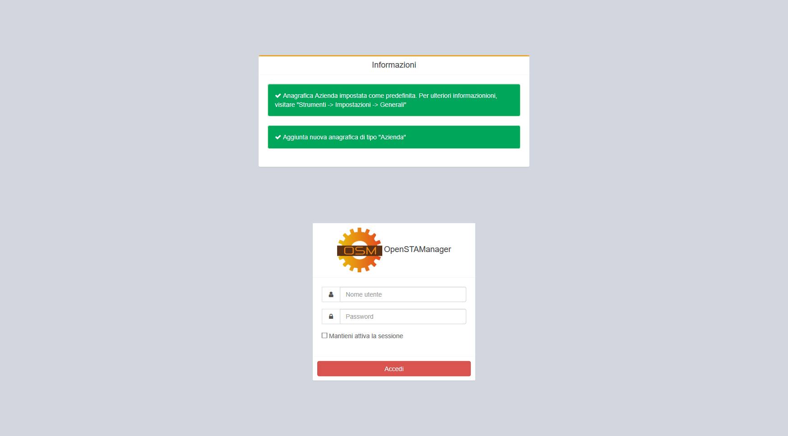

# Inizializzazione


Una volta completata l'installazione del gestionale, ed in alcuni casi a seguito di un aggiornamento, può essere presentata un'ulteriore schermata per l'inizializzazione del software.


Attraverso questa funzionalità vengono generalmente completate delle informazioni di base per il funzionamento del software, suddivise secondo tre categorie:

* Amministrazione
* Azienda predefinita
* Impostazioni di base

Nel caso questa schermata si presenti a seguito di un aggiornamento, potrebbe richiedere la compilazione esclusiva di una parte delle informazioni elencate di seguito.

## Amministrazione


La sezione **Amministrazione** permette di configurare le credenziali dell'account di amministrazione predefinito, ed è accessibile solo dopo la prima installazione.


E' in particolare possibile definire:

* Username dell'account
* Password dell'account
* Email collegata

## Azienda predefinita


La sezione **Azienda predefinita** richiede il completamento delle informazioni relative all'azienda destinata ad utilizzare il gestionale.


In particolare, è possibile definire la _ragione sociale_ e una serie di dati anagrafici di base. E' inoltre possibile caricare il _logo aziendale_, che verrà successivamente implementato nelle stampe del gestionale.

## Impostazioni di base


Infine, la sezione **Impostazioni di base** prevede la compilazione di alcune opzioni di OpenSTAManager obbligatorie per il funzionamento di diverse componenti, quali per esempio la contabilità e la fatturazione elettronica.


## Salvataggio


Una volta completate correttamente le informazioni richieste dalle sezioni precedenti, è possibile procedere al salvataggio delle stesse e al successivo utilizzo del software cliccando sul pulsante **Configura**.


Sarà possibile accedere fin da subito con le credenziali di amministrazione immesse in precedenza.

