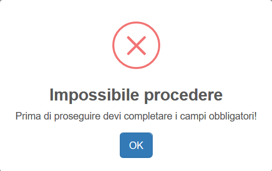
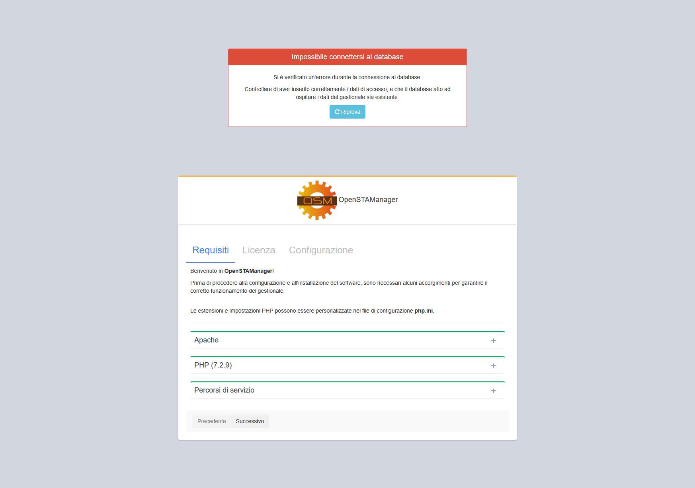

# Installazione

Per procedere all'installazione di OpenSTAManager è necessario seguire i seguenti punti:

1. [Scaricare una release ufficiale del progetto](https://github.com/devcode-it/openstamanager/releases).
2. Creare una cartella \(ad esempio `openstamanager`\) nella root del _web server_ ed estrarvi il contenuto della release scaricata \(per maggiori informazioni, [consultare la documentazione tecnica](../../docs/docs-1/installazione.md)\)
3. Creare un database vuoto \(tramite [PHPMyAdmin](http://localhost/phpmyadmin/) o riga di comando\).
4. Accedere a [http://localhost/openstamanager](http://localhost/openstamanager) dal vostro browser.

Una volta completate le istruzioni per l'installazione del software, è necessario procedere alla sua configurazione per permetterne il funzionamento nell'ambiente di utilizzo.

Questa procedura può essere suddivisa in tre sezioni differenti:

* Controllo dei requisiti
* Revisione della licenza del software
* Configurazione delle credenziali di accesso al database MySQL

## Requisiti

Il software permette in automatico di controllare se l'ambiente di utilizzo presenta una configurazione adeguata per il suo corretto funzionamento.

In particolare, viene richiesta la presenza di un _web server_ [Apache](https://httpd.apache.org/) con il linguaggio di programmazione [PHP](http://php.net) e il [DBMS MySQL](https://www.mysql.com), richiedendo le seguenti versioni minime:

* PHP &gt;= 5.6
* MySQL &gt;= 5.6.5

Nel caso la versione PHP non sia compatibile, viene mostrato immediatamente un messaggio informativo a riguardo:

Successivamente, se il controllo precedente viene soddisfatto, il software verrà effettivamente avviato e sarà possibile procedere nella configurazione.

Viene quindi caricata la pagina per il controllo della configurazione del _web server_, di cui vengono controllati vari componenti:

* Moduli Apache
* Estensioni PHP
* Percorsi di servizio per il software

Nel caso vengano mostrati dei componenti in rosso, è consigliato procedere all'attivazione del modulo/estensione seguendo le linee guida ufficiali del relativi software \([PHP ](http://php.net/manual/en/install.pecl.windows.php)o [Apache](https://stackoverflow.com/a/5758551)\).

Una volta corretti correttamente i requisiti, cliccare  .

## Licenza

La schermata successiva a quella dei requisiti consiste nella gestione della licenza di utilizzo del software.

OpenSTAManager viene reso disponibile tramite la licenza **GPL-3.0**, che ne permette l'uso commerciale e la personalizzazione a patto di mantenere un riferimento al progetto iniziale rimuovendo la responsabilità di eventuali problematiche agli sviluppatori originali.

Una volta accettata la licenza, cliccare su **Successivo**.

**Non è possibile procedere all'utilizzo del software senza aver accettato la licenza.**

## Database

Una volta corretti i requisiti e accettata la licenza, viene resa disponibile la pagina dedicata alla configurazione del software per l'accesso al database MySQL.

E' possibile, una volta completate le informazioni di configurazione, procedere ad un test automatico per controllare se il database presente è completamente compatibile con il gestionale. Questa funzione è disponibile attraverso il pulsante **Testa il database**.

In ogni caso, si possono verificare degli errori duranti il salvataggio della configurazione se:

* I dati di connessione sono errati

* I permessi di creazione e scrittura sul file `config.inc.php` sono troppo restrittivi

Se le credenziali inserite sono corrette, dopo aver cliccato su **Installa** si verrà reindirizzati alla procedura automatica di installazione del database.

## Installazione del database

Una volta inseriti correttamente i parametri di configurazione, è sufficiente cliccare sul pulsante  per avviare l'installazione del database di OpenSTAManager.

Per maggiori informazioni su questa procedura, oppure nel caso si verificassero degli errori, visitare la sezione **Aggiornamento**.

[Vai alla sezione Aggiornamento](aggiornamento.md)

## Inizializzazione

Una volta completati i precedenti passaggi con successo, verrà richiesta di inizializzare il gestionale con delle informazioni di base.

[Vai alla sezione Inizializzazione](inizializzazione.md)

