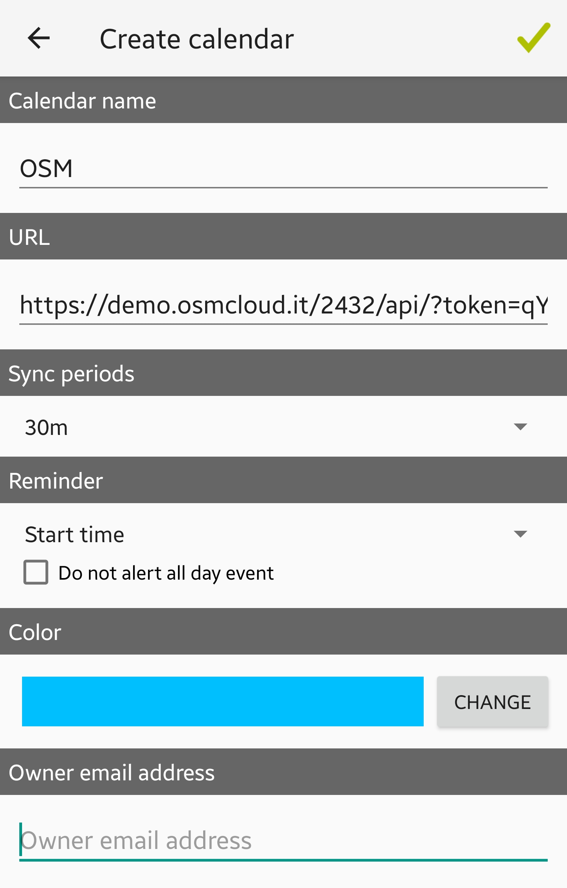
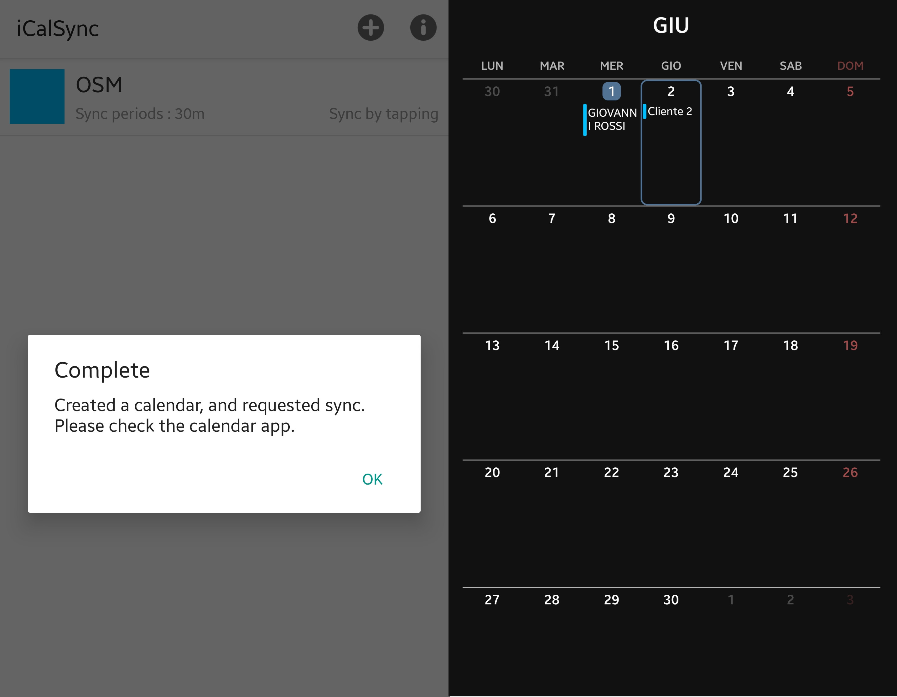

# 📲 Calendario su telefono

## 📱 Sistema Android

L'importazione del calendario attività su sistema Android è possibile tramite l'app iCalSync, scaricabile da playstore ([https://play.google.com/store/search?q=iCalSync\&c=apps](https://play.google.com/store/search?q=iCalSync\&c=apps)).

Per prima cosa si dovrà risalire all'API token, visualizzabile dalla schermata che si presenterà cliccando sul nome dell'azienda, sotto calendario interventi.

.png>)

.png>)


L'API corretto è quello nella sezione di destra: Calendario interventi. Copiando l'API nella sezione API (sinistra) la procedura non andrà a buon fine.


Si dovrà ora lanciare l'app iCalSync appena scaricata e la schermata che si presenterà sarà questa, dove si andranno ad inserire il nome del calendario, l'API token e la frequenza di sincronizzazione.

&#x20;                                                                 

Andando ora ad aprire il calendario si potranno vedere gli interventi registrati sulla dashboard.

.png>)

&#x20;                                                          

Il calendario si sincronizzerà ogni 30 minuti come preimpostato, per forzare la sincronizzazione di un'attività appena creata in dashboard basterà premere sul calendario OSM dentro l'app.

.png>)

## 📱 Sistema iOS

Con sistema iOS si può configurare un nuovo calendario dall'app standard del calendario.

## 📮 Outlook

Per sincronizzare il calendario di Outlook con quello di OpenSTAManager sarà sufficiente seguire la guida ufficiale outlook: [https://support.microsoft.com/en-us/office/import-calendars-into-outlook-8e8364e1-400e-4c0f-a573-fe76b5a2d379](https://support.microsoft.com/en-us/office/import-calendars-into-outlook-8e8364e1-400e-4c0f-a573-fe76b5a2d379)

Sarà necessario risalire all'API token, cliccando sul nome utente.

<figure><figcaption></figcaption></figure>


Il link da utilizzare per la corretta configurazione di outlook è quello nella sezione di destra: Calendario interventi.


<figure><figcaption></figcaption></figure>

## 🐦 Thunderbird

Per poter sincronizzare il calendario di OpenSTAManager con Thunderbird sarà necessario installare un componente aggiuntivo: [https://addons.thunderbird.net/en-US/thunderbird/addon/provider-for-google-calendar/](https://addons.thunderbird.net/en-US/thunderbird/addon/provider-for-google-calendar/)

Questo permetterà la creazione di un nuovo Google calendar che sarà possibile sincronizzare con il calendario del gestionale tramite l'API token del gestionale, disponibile nella sezione Calendario interventi, cliccando sul proprio nome utente.

<figure><figcaption></figcaption></figure>

<figure><figcaption></figcaption></figure>

