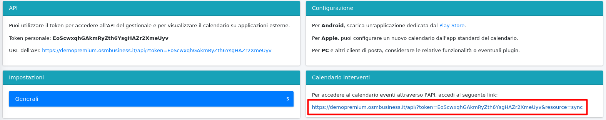

# 📲 Calendario su telefono

## Sistema Android

L'importazione del calendario attività su sistema Android è possibile tramite l'app **ICSx⁵**, scaricabile in 2 modi:

* Google Play Store (1,99€): [https://play.google.com/store/search?q=ICSx5\&c=apps\&hl=it](https://play.google.com/store/search?q=ICSx5\&c=apps\&hl=it)
* F-Droid (gratuita): [https://f-droid.org/it/packages/at.bitfire.icsdroid/](https://f-droid.org/it/packages/at.bitfire.icsdroid/)


**Cos'è F-Droid?**

E' una catalogo di applicazioni, come il Play Store di Google, ma contiene esclusivamente applicazioni open source e gratuite. Lo puoi installare dal sito ufficiale: [https://f-droid.org/](https://f-droid.org/)

In seguito, troverai F-Droid nel tuo telefono, dal quale installare applicazioni open source e libere.


Per prima cosa, è necessario recuperare il token API, che è visibile nella schermata che si apre cliccando sul nome dell'azienda, sotto la sezione "calendario interventi".

<figure><figcaption></figcaption></figure>

<figure><figcaption></figcaption></figure>


L'indirizzo corretto è quello nella sezione di destra: **Calendario interventi**. Copiando l'API dalla sezione API (sinistra) la procedura non andrà a buon fine.


Dopo aver installato l'app ICSx⁵, è necessario avviarla e utilizzare il pulsante "+" per aggiungere un nuovo calendario tramite l'API token precedentemente ottenuto.\
Una volta aggiunto il calendario, sarà possibile configurare l'intervallo di sincronizzazione accedendo al menu tramite i tre puntini situati in alto a destra.

Andando ora ad aprire il calendario si potranno vedere gli interventi registrati sulla dashboard.

<figure><figcaption></figcaption></figure>

Il calendario si sincronizzerà ogni 15 minuti come preimpostato, per forzare la sincronizzazione di un'attività appena creata in dashboard basterà premere i tre puntini in alto a destra e scegliere l'opzione Force sync.

<figure><figcaption></figcaption></figure> <figure><figcaption></figcaption></figure>

## Sistema iOS

Con sistema iOS si può configurare un nuovo calendario dall'app standard del calendario.

## Outlook

Per sincronizzare il calendario di Outlook con quello di OpenSTAManager sarà sufficiente seguire la guida ufficiale outlook: [https://support.microsoft.com/en-us/office/import-calendars-into-outlook-8e8364e1-400e-4c0f-a573-fe76b5a2d379](https://support.microsoft.com/en-us/office/import-calendars-into-outlook-8e8364e1-400e-4c0f-a573-fe76b5a2d379)

Sarà necessario risalire all'API token, cliccando sul nome utente.

<figure><figcaption></figcaption></figure>


Il link da utilizzare per la corretta configurazione di outlook è quello nella sezione di destra: Calendario interventi.


<figure><figcaption></figcaption></figure>

## Thunderbird

Per poter sincronizzare il calendario di OpenSTAManager con Thunderbird sarà necessario installare un componente aggiuntivo: [https://addons.thunderbird.net/en-US/thunderbird/addon/provider-for-google-calendar/](https://addons.thunderbird.net/en-US/thunderbird/addon/provider-for-google-calendar/)

Questo permetterà la creazione di un nuovo Google calendar che sarà possibile sincronizzare con il calendario del gestionale tramite l'API token del gestionale, disponibile nella sezione Calendario interventi, cliccando sul proprio nome utente.

<figure><figcaption></figcaption></figure>

<figure><figcaption></figcaption></figure>

