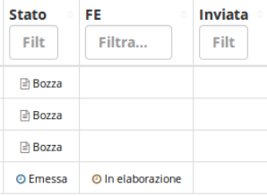

# 📘 Fatturazione Elettronica

## Introduzione


La fatturazione elettronica è un sistema **digitale** di **emissione**, **trasmissione** e **conservazione** delle fatture. Questo significa che non servirà più stampare e conservare la versione cartacea delle fatture, ma basterà generare un file XML con determinate caratteristiche, che dovrà essere inviato al **Sistema Di Interscambio** (SDI), un sistema di smistamento e archiviazione fatture elettroniche gestito dall’**Agenzia Entrate**.


Dal 1° Gennaio 2019, la fattura elettronica è diventata obbligatoria per i privati detentori di partita IVA escludendo alcune categorie.

Dal 1° Luglio 2022 l'obbligo è stato esteso anche a chi rientra nel regime forfettario.

## 📤 Fatture di vendita

Per inviare una fattura elettronica è necessario creare la fattura dal modulo **Fatture di vendita**, impostare lo stato in Emessa e salvare.

Con l'emissione della fattura il gestionale genererà in modo automatico il suo XML, si dovrà ora accedere al plugin Fatturazione Elettronica e cliccare Invia.

.png>)

Dopo aver inviato la fattura, accedendo al modulo Fatture di vendita, sarà possibile vedere che lo stato FE della fattura appena inviata è cambiato in "In elaborazione".&#x20;


La fattura è ora in attesa di essere verificata dallo SDI, che provvederà entro qualche giorno a mandarci una ricevuta di ricezione per comunicarci se la fattura è stata accettata o scartata.


Per verificare la presenza di ricevute da parte dello SDI si deve andare nell'apposita sezione Ricevute FE, presente in Fatture di vendita.

.png>)

Da qui sarà possibili cliccare su Ricerca ricevute per verificare la presenza di ricevute da importare, e su Importa tutte le ricevute per importarle massivamente.

.png>)

### 🏷️ **Stati**

Gli stati possono essere:

* **In elaborazione:** la fattura è in transito dal gestionale allo SDI
* **Consegnata:** la fattura è arrivata al cliente
* **Scartata:** la fattura è stata scartata perché contiene degli errori. Aprendo la rispettiva fattura e cliccando sul plugin **Fatturazione elettronica**, è possibile leggere lo stato dell'errore.


In questo caso non va emessa una nota di credito per annullare la fattura, si deve invece apportate le dovute correzzioni, rigenerare la fattura e reinviarla allo SDI.


* **Mancata consegna:** la fattura risulta inviata all'Agenzia delle Entrate, ma il ricevente non ha definito un canale tramite cui riceverla, per cui la visualizzerà solo accedendo al proprio cassetto fiscale.&#x20;


Questo caso è **frequente** nel caso di invio **fatture elettroniche** a persone fisiche o per aziende che non hanno definito un canale di ricezione. In questi casi, è necessario/consigliato inviare una copia di cortesia via mail o su supporto cartaceo per informare dell'invio della fattura elettronica


* **Accettata** (solo Pubblica Amministrazione): significa che la fattura è stata consegnata e che il ricevente ha accettato i dati in essa contenuti.


**ATTENZIONE:** Quando emetto una **Fattura** per le **Pubbliche Amministrazioni** devo verificare di aver inserito il **codice fiscale** nella rispettiva **Anagrafica,** oltre che il corretto Codice Destinatario. Altrimenti, all'invio della fattura, comparirà il seguente errore: **00305-1.4.1.1.2 IdCodice non valido**.


## 📥 Fatture di acquisto

Per scaricare le fatture passive dai fornitori è necessario cliccare su Fatturazione elettronica dal modulo Fatture di acquisto.

.png>)

Sarà possibile ora visualizzare una lista delle fatture di acquisto da importare dallo SDI, che sarà possibile importare massivamente cliccando su Importa in sequenza.

.png>)

Per completare l'importazione, gli unici dati obbligatori sono quelli contrassegnati con un asterisco, quindi:

* Tipo fattura
* Pagamento
* Dati contabili (IVA e conto).

## 🤖 Automatismi

In fase di importazione di una fattura elettronica, è possibile selezionare quali righe convertire in articolo di magazzino, dopo aver spuntato _Creazione automatica articoli_.

 (1).png>)

Sarà così possibile movimentare automaticamente il magazzino senza dover ricorrere ad ulteriori passaggi.
