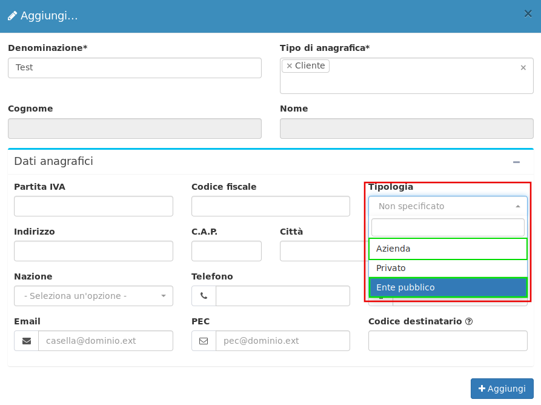
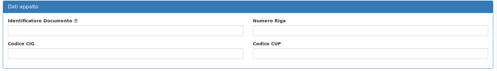
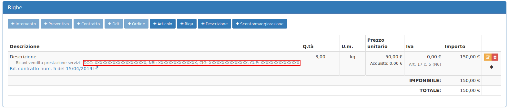
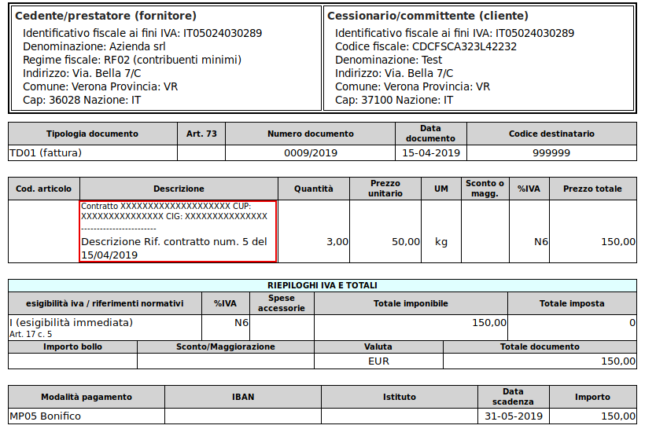
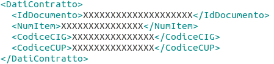

# 🏷️ Codice identificativo documento e CIG


Quando si vuole emettere una fattura verso le PA è necessario riportare il **CIG** e il **Codice identificativo documento**. Come inserire questi due parametri in **OpenSTAManager**?


Il primo passo è quello di specificare nella creazione di un'anagrafica la tipologia **Ente pubblico** o **Azienda**:

Se l'anagrafica è già stata creata basta modificarla e selezionare tipologia **Ente pubblico** o **Azienda:**

Ora, nella creazione di un **Contratto**, è possibile compilare i campi necessari per l'emissione di una Fattura verso le PA:

I **Dati appalto** verranno visualizzati quando si aggiunge un **Contratto** ad una **fattura di vendita,** in questo modo è possibile verificare se sono stati inseriti.

Un' ulteriore verifica della presenza o meno dei **Dati appalto** è disponibile nell'anteprima della fattura, visualizzabile tramite il pulsante **Visualizza** in **Fatturazione elettronica:**

.png>)

Infine sono visibili nel file XML generato:


La logica precedentemente spiegata vale per l'inserimento di **Contratti, Ordini cliente** e **Interventi.**

