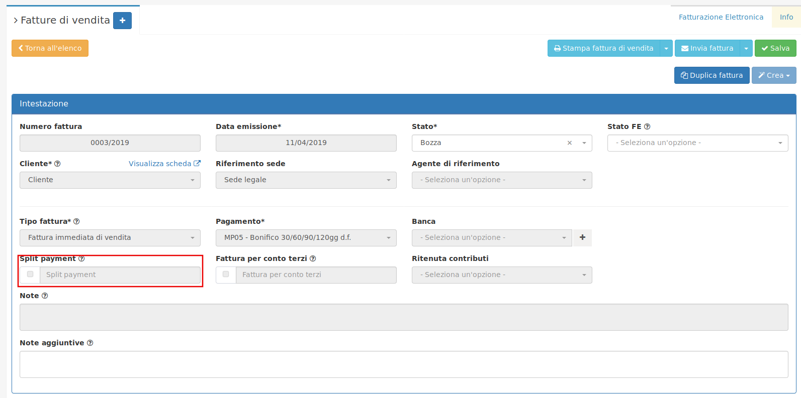
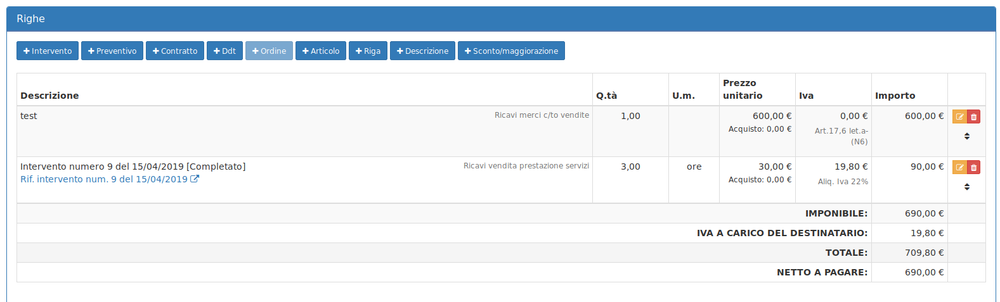
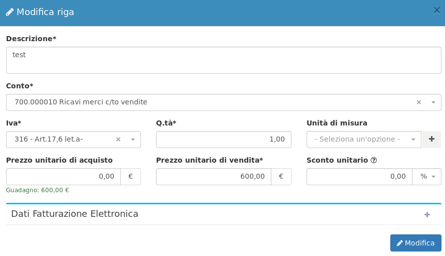
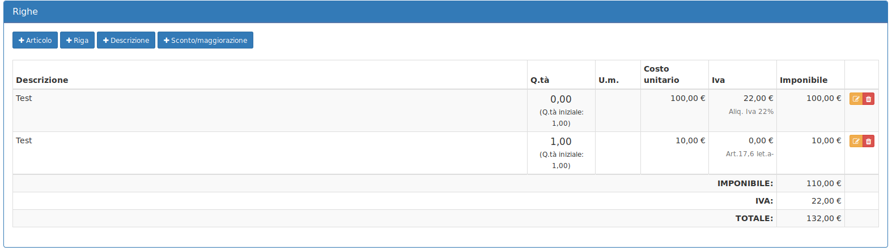

# 🏫 Split payment e reverse charge


La pubblica amministrazione richiede **Split payment** o **Reverse charge**. Come gestire questi due parametri in **OpenSTAManager**?


## ✂️ Split payment

Creando una fattura di vendita è possibile abilitare lo **split payment** spuntando la casella sotto indicata.

Così facendo nella tabella **Righe** il **Totale** sarà comprensivo di **IVA,** mentre il **Netto a pagare** sarà **IVA esclusa** perché l'imposta relativa alla transizione sarà a carico della pubblica amministrazione.

Si dovrà inoltre cliccare su Attributi avanzati e andare a inserire l'IdDocumento e a valorizzare almeno uno dei due campi CodiceCUP e CodiceCIG.

.png>)

.png>)

## &#x20;🔋 Reverse charge

Il riferimento normativo del _**reverse charge**_ IVA in Italia è rappresentato dall'_articolo 17_, commi 5 e 6. Il reverse charge è applicabile quindi andando a selezionare l'aliquota IVA corretta nel momento di creazione di una riga:

Il risultato ottenuto sarà il seguente:

