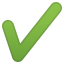

# 🔨 Verificare l'installazione di OSM

## Verificare che i requisiti di OSM siano rispettati

L'installazione del gestionale richiede la presenza di un web server Apache con abilitato il [DBMS MySQL](https://www.mysql.com) e il linguaggio di programmazione [PHP](https://php.net).

| PHP | EOL        |                                                        Supportato                                                       |
| --- | ---------- | :---------------------------------------------------------------------------------------------------------------------: |
| 8.5 | 20/11/2025 |  |
| 8.4 | 21/11/2024 |  |
| 8.3 | 23/11/2026 |  |

| MYSQL | EOL        |                                                        Supportato                                                       |
| ----- | ---------- | :---------------------------------------------------------------------------------------------------------------------: |
| 8.4   | 30/04/2032 |                                                      |
| 8.3   | 10/04/2024 |  |
| 8.2   | 14/12/2023 |  |
| 8.1   | 25/10/2023 |  |
| 8.0   | 30/04/2026 |  |

Le versioni di PHP supportate sono dalla 8.3 alla 8.5, mentre quelle di MySQL dalla 8.0 alla 8.4.


Stiamo introducendo la compatibilità con MariaDB


Si può verificare se i requisiti vengono rispettati da Strumenti/Aggiornamenti, nella sezione evidenziata.

<figure><figcaption></figcaption></figure>

### Incongruenze file e database

In questa sezione è possibile identificare incongruenze tra i valori attesi a database e quelli effettivamente presenti nel software, dovuti a personalizzazioni, aggiornamenti interrotti, o query che possono aver dato errore in fase di aggiornamento.

<figure><figcaption></figcaption></figure>

#### File personalizzati

In questa sezione vengono riportati i file che sono stati modificati rispetto al checksum presente nello zip della release:

<figure><figcaption></figcaption></figure>

#### Tabelle non previste

In questa sezione vengono elencate le tabelle non previste nella versione community edition del gestionale, che possono derivare da interventi dell'utente, personalizzazioni o vecchie tabelle che le query di aggiornamento non sono riuscite a rinominare o rimuovere

<figure><figcaption></figcaption></figure>

#### Viste personalizzate

In questa sezione vengono indicate le viste personalizzate dal modulo Viste, indicando il valore atteso (in verde) e quello presente nel gestionale (in rosso), la modifica di questi valori può causare la rottura della query relativa alla vista del modulo. Consigliamo di verificare e allineare le viste personalizzate a seguito di ogni aggiornamento.

<figure><figcaption></figcaption></figure>

#### Moduli personalizzati

In questa sezione vengono indicate le query dei moduli personalizzati dal modulo Viste, sia dove è stata aggiunta una query custom nel campo options2:

<figure><figcaption></figcaption></figure>

sia quando la query originale non corrisponde a quella prevista, a causa di un errore di aggiornamento o una modifica utente:

<figure><figcaption></figcaption></figure>

#### Campi personalizzati

In questa sezione vengono evidenziati i campi mancanti a database, i campi modificati, le chiavi esterne assenti e quelle modificate

<figure><figcaption></figcaption></figure>

#### Impostazioni personalizzate

In questa sezione vengono indicate le impostazioni che hanno a database un valore del campo tipo diverso da quello atteso:

<figure><figcaption></figcaption></figure>

#### Widgets personalizzati

In questa sezione vengono elencati i widgets che hanno a database una query diversa da quella prevista, e potrebbero quindi non essere allineati, ed eventuali widgets personalizzati:

<figure><figcaption></figcaption></figure>

### Controlli di integrità

E' possibile effettuare i controlli di integrità sul gestionale in questa apposita sezione:

<figure><figcaption></figcaption></figure>

