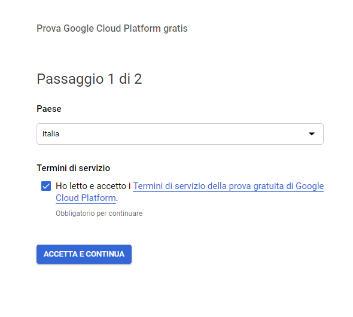

# Maps


Nella modifica e nella fase di creazione di una nuova **anagrafica** è possibile visualizzare attraverso _Google Maps_ l'indirizzo indicato ed eventualmente definire manualmente latitudine e longitudine.


Per fare ciò basta cliccare sopra il link mostrato nella figura sottostante

Successivamente si verrà indirizzati in _impostazioni_ in modo di abilitare la visualizzazione delle anagrafiche nella mappa compilando alcuni campi.

Per visualizzare la posizione è obbligatorio compilare il campo _Google Maps API Key_.

## Come ottenere Google Maps API Key

1. Cliccare su questo link: [https://cloud.google.com/maps-platform/?\_\_utma=102347093.1283278314.1550498378.1550499031.1550499031.1&\_\_utmb=102347093.0.10.1550499031&\_\_utmc=102347093&\_\_utmx=-&\_\_utmz=102347093.1550499031.1.1.utmcsr=google\|utmccn=\(organic\)\|utmcmd=organic\|utmctr=\(not provided\)&\_\_utmv=-&\_\_utmk=128107788&\_ga=2.39899682.1839265660.1550498378-1283278314.1550498378\#get-started](https://cloud.google.com/maps-platform/?__utma=102347093.1283278314.1550498378.1550499031.1550499031.1&__utmb=102347093.0.10.1550499031&__utmc=102347093&__utmx=-&__utmz=102347093.1550499031.1.1.utmcsr=google|utmccn=%28organic%29|utmcmd=organic|utmctr=%28not%20provided%29&__utmv=-&__utmk=128107788&_ga=2.39899682.1839265660.1550498378-1283278314.1550498378#get-started)

Apparirà questa schermata:

Fare la spunta su tutte e 3 le caselle e premere  .

* Entrare con la vostra email
* Inserire email

* Inserire password

* Se appare nuovamente la schermata del punto uno fare nuovamente la spunta sulle 3 caselle, se non appare, invece, apparirà questa schermata:

* Selezionare **Yes** e cliccare su  , comparirà questa finestra:

* Cliccare su  **:**

* Cliccare su  , accettando i termini di servizio
* Compilare i campi campi richiesti e cliccare su _**AVVIA LA MIA PROVA GRATUITA**_


**Attenzione:** Mettendo i dati della carta di credito non verrà fatto alcun addebito, sono richiesti solamente per verifica. Se si prova in qualche modo a saltare l'inserimento del metodo di pagamento e a generare comunque l'API, essa non funzionerà. L'inserimento del metodo di pagamento è obbligatorio.


Successivamente cliccare sulle 3 linee in alto a sinistra,andare su **API e servizi** e selezionare  

Cliccare su  , selezionare _Chiave API_. Ora la chiave API è stata creata.

