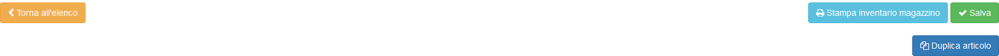

# Azioni aggiuntive

Nella parte superiore della pagina viene inoltre permessa la visualizzazione di una serie di opzioni dedicate al modulo **Articoli**:

* Stampa dell'inventario
* [Duplicazione dell'articolo](modifica.md#duplica-articolo)

### Duplica articolo

La funzione _**Duplica articolo**_ permette la creazione di un articolo simile a quello corrente, con quantità, seriali e movimenti reimpostati ai valori predefiniti.

