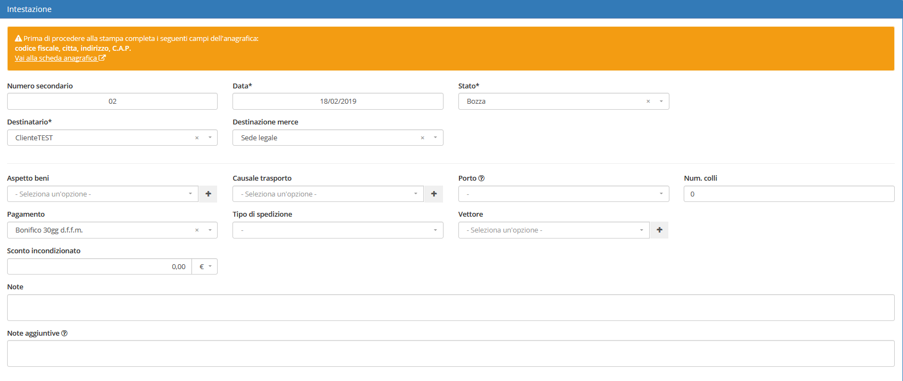

# Modifica

La sezione di modifica degli elementi del modulo segue il sistema standard del gestionale, necessitando il click sulla riga relativa al _record_ all'interno della tabella della schermata principale.

## Caratteristiche

Una volta all'interno di questa parte del sistema, il modulo **Ddt in uscita** permette di completare _tutte_ le informazioni che il gestionale supporta per le anagrafiche. In particolare, per permettere un maggiore senso logico nella navigazione dei dati, la sezione di modifica è suddivisa in 3 raggruppamenti:

* [Intestazione](modificaddtinuscita.md#intestazione)
* [Righe](modificaddtinuscita.md#righe)
* [Allegati](modificaddtinuscita.md#allegati)

### Intestazione

Il raggruppamento **intestazione** permette di aggiungere:

* Stato
* Destinazione merce
* Aspetto beni
* Causale trasporto
* Porto
  * Franco: pagamento del trasporto a carico del mittente 
  * Assegnato: pagamento del trasporto a carico del destinatario
* Num.colli
* Pagamento
* Tipo di spedizione
* Vettore 
* Sconto incondizionato
* Note
* Note aggiuntive\(interne\)

### Righe

Il modulo **Ddt in uscita** integra all'interno della sezione **Righe** la gestione delle spese relative ai propri elementi.

Cliccando sui pulsanti relativi, è possibile procedere quindi alla creazione di nuove spese relative ai **Ddt in uscita**:

* Ordine
* Articolo
* Riga
* Descrizione

Una volta inserite correttamente le informazioni richieste, la nuova spesa verrà aggiunta all'elenco.

E' quindi possibile procedere alla modifica e all'eventuale rimozione della spesa attraverso i pulsanti dedicati della spesa.

### Allegati

**Allegati** permette di importare un file dal proprio computer specificando una categoria.

## Attenzione

Prima di procedere alla stampa bisogna completare i seguenti campi dell'anagrafica:

* Codice fiscale
* Città
* Indirizzo
* C.A.P

