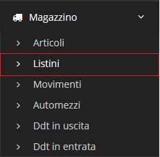

# Listini

Il modulo **Listini** permette di creare dei gruppi con un determinato sconto, associabili a dei clienti.

## Navigazione

Il modulo è raggiungibile attraverso il menu laterale del gestionale, sotto il link **Listini** visibile dall'espansione del menu **Magazzino**.

