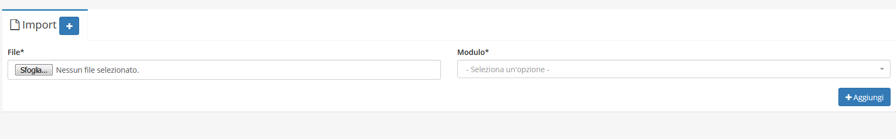

# Import


Il modulo **Import** permette di caricare dei file CSV per aggiungere dei record nel modulo _Articoli_ o _Anagrafiche._


## Navigazione

Il modulo è raggiungibile attraverso il menu laterale del gestionale, sotto il link **Strumenti**.

## Creazione

La creazione di nuovi elementi segue il funzionamento standard del gestionale, necessitando il click sul pulsante apposito all'interno dell'intestazione del modulo.

Proseguendo con il click sul tasto  apparirà questa schermata:

La quale mostrerà il contenuto di ogni colonna. Cliccando su   il file viene importato nel modulo _Articoli_.

### Attenzione


Se devi importare un file **CSV** di una **Anagrafica** devi andare ad aggiungere nel file una colonna **Tipologia** specificando il **Tipo di anagrafica\(Agente,Vettore,Cliente,Azienda,Fornitore\)**



Non andando a specificare la **Tipologia** nel modulo **Anagrafiche** il campo **Tipo** rimarrà vuoto.

Nell'immagine sottostante il _record_ con **Ragione sociale Test** ha il campo **Tipo** vuoto, mentre nel successivo _record_ è presente, proprio perché è specificata la **Tipologia** nel file **CSV.** 


