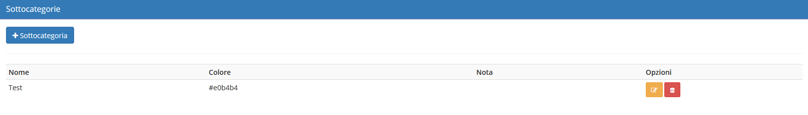

# Categorie articoli

Il modulo **Categorie articoli** permette di aggiungere nuove _Categorie articoli_ al campo _**Categorie articoli**_ nella creazione di un **Articolo**:

## Navigazione

Il modulo è raggiungibile attraverso il menu laterale del gestionale, sotto il link **Tabelle** nel link **Strumenti**.

## Creazione

La creazione di nuovi elementi segue il funzionamento standard del gestionale, necessitando il click sul pulsante apposito all'interno dell'intestazione del modulo.

E' sufficiente inserire il _Nome_, una _Data_ e un eventuale _Nota_ per creare una nuova **Categorie articoli**.

## Modifica

La sezione di modifica degli elementi del modulo segue il sistema standard del gestionale, necessitando il click sulla riga relativa al _record_ all'interno della tabella della schermata principale.La sezione di modifica è suddivisa in 2 raggruppamenti:

* Dati 
* Sottocategorie

### Dati

Questo primo raggruppamento permette di modificare i **Dati** inseriti nella creazione,quali:

* Nome
* Colore
* Note

### Sottocategoria

Dove sarà possibile aggiungere una _**Sottocategoria**_ premendo il tasto  

E' sufficiente inserire il _Nome_, una _Data_ e un eventuale _Nota_ per creare una nuova **Sottocategoria**.

