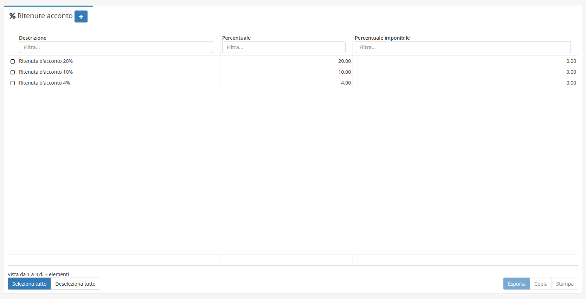

# Ritenute acconto


Il modulo **Ritenute Acconto** permette di aggiungere nuove _Ritenute Acconto_ al relativo campo.


## Navigazione

Il modulo è raggiungibile attraverso il menu laterale del gestionale, sotto il link **Tabelle** nel link **Strumenti**.

## Creazione

La creazione di nuovi elementi segue il funzionamento standard del gestionale, necessitando il click sul pulsante apposito all'interno dell'intestazione del modulo.

E' sufficiente inserire una _Descrizione_, la _Percentuale_ e una _Percentuale imponibile_ per creare una nuova **Ritenuta di Acconto**.

## Modifica

La sezione di modifica degli elementi del modulo segue il sistema standard del gestionale, necessitando il click sulla riga relativa al _record_ all'interno della tabella della schermata principale.

Si presenterà quindi questa schermata:

Dove sarà possibile modificare:

* Descrizione
* Percentuale
* Percentuale imponibile

