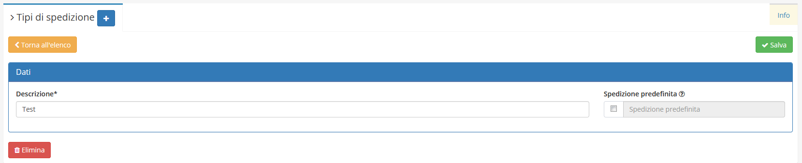

# Tipi di spedizione

Il modulo **Tipi di spedizione** __permette di aggiungere nuovi __**Tipi di spedizione** __al relativo campo richiesto nei diversi moduli.

## Navigazione

Il modulo è raggiungibile attraverso il menu laterale del gestionale, sotto il link **Tabelle** nel link **Strumenti**.

## Creazione

La creazione di nuovi elementi segue il funzionamento standard del gestionale, necessitando il click sul pulsante apposito all'interno dell'intestazione del modulo.

E' sufficiente inserire una _Descrizione_ per creare un nuovo **Tipo di spedizione**.

## Modifica

La sezione di modifica degli elementi del modulo segue il sistema standard del gestionale, necessitando il click sulla riga relativa al _record_ all'interno della tabella della schermata principale.

Si presenterà quindi questa schermata:

