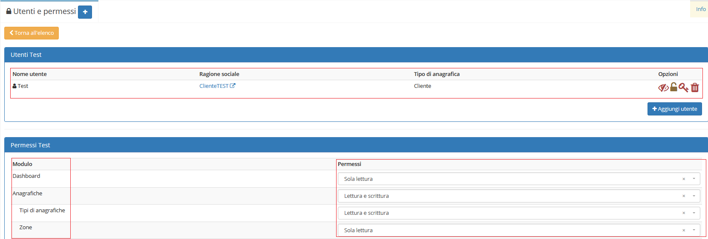

# Utenti e permessi

Il modulo **Utenti e permessi** permette di assegnare determinati utenti ad un gruppo,concedendoli dei privilegi.

## Navigazione

Il modulo è raggiungibile attraverso il menu laterale del gestionale, sotto il link **Strumenti**.

## Creazione

La creazione di nuovi elementi segue il funzionamento standard del gestionale, necessitando il click sul pulsante apposito all'interno dell'intestazione del modulo.

Basterà quindi inserire il _nome_ per creare un nuovo gruppo

## Modifica

La sezione di modifica degli elementi del modulo segue il sistema standard del gestionale, necessitando il click sulla riga relativa al _record_ all'interno della tabella della schermata principale.

Si presenterà quindi questa schermata:

Nella quale è possibile aggiungere un _utente_ al gruppo appena selezionato:

Aggiungendo un _utente_, per potergli permettere l'accesso, bisogna assegnarli:

* Username
* Email
* Password
* Collega ad una anagrafica

Con la possibilità di modificare i _permessi_,divisi per modulo,inerenti al gruppo selezionato. I permessi che si possono concedere ad un _utente_ sono:

* Solo lettura\(quindi non può apportare alcuna modifica\)
* Lettura e scrittura\(permesso di visualizzare il modulo

  e apportare modifiche\)

Esempio:

