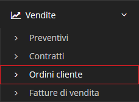

# Ordini cliente


Il modulo **Ordini cliente** permette all'utente di creare un documento per richiedere prodotti o servizi da parte di un cliente stabilendone tempistiche e tipo di pagamento.


## Navigazione

Il modulo è raggiungibile attraverso il menu laterale del gestionale, sotto il modulo **Vendite**.

## Caratteristiche

La schermata principale del modulo è strutturata secondo la tabella generale predefinita. La modifica di un _record_ del modulo **Ordini cliente** presenta la possibilità di utilizzare delle [Azioni aggiuntive](../fatturedivendita/plugin.md)

