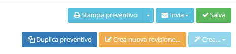

# Azioni aggiuntive

Selezionando o creando un _record_ in **Fatture di vendita** sono presenti nella parte in alto a destra degli strumenti che consentono diverse opzioni, quali:

* Stampa preventivo
  * Stampa preventivo \(senza costi\)
  * Stampa preventivo \(senza totali\)
  * Stampa consuntivo preventivo \(senza costi\)
  * Stampa consuntivo preventivo
* Invia
  * Invia preventivo 
  * Invia consuntivo preventivo 
* Duplica preventivo
* Crea nuova revisione
* Crea
  * Ordine
  * Fattura

