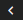

# 📘 Interfaccia

OpenSTAManager presenta un'interfaccia generale piuttosto chiara, basata su strutture comuni e di semplice utilizzo.

## 🛥️ Navigazione

La navigazione attraverso le diverse sezioni del gestionale viene resa possibile dal menu laterale, visibile in ogni pagina e rappresentante i moduli a cui l'utente autenticato ha accesso. Questo menu si compone generalmente di macro-sezioni per argomento (quali **Attività**, **Vendite**, **Acquisti**) che raggruppano diversi moduli al loro interno, generalmente visualizzabili cliccando sul simbolo  .

Nella parte più alta di questa componente è inoltre presente una barra di ricerca generalizzata all'interno del gestionale, che permette di effettuare ricerche tra i moduli che supportano questa funzione.

.png>)

La sezione aperta a gestionale si può distinguere da un colore di sfondo più scuro nel menu.

## ⏱️️Selezione temporale

Nella sezione in alto a sinistra di ogni modulo è possibile selezionare il periodo temporale a cui il gestionale farà riferimento per l'individuazione delle informazioni di ogni modulo.

Sono presenti diversi valori preimpostati:

* Oggi
* I trimestre
* II trimestre
* III trimestre
* IV trimestre
* I semestre
* II semestre
* Questo mese
* Mese scorso
* Mese prossimo
* Quest'anno (_default_)
* Anno scorso
* Personalizzato

Questa funzionalità è sfruttata in particolare da moduli in cui il periodo di tempo è rilevante (quali, per esempio, **Attività** e **Fatture**) mentre in altri non provoca alcun effetto (per esempio, **Dashboard** e **Articoli**).

 (1).png>)

## ⚙️ Opzioni di controllo

Parallelamente alla possibilità di selezionare il periodo temporale, vengono rese disponibili alcune opzioni aggiuntive nella sezione in alto a destra del software.

.png>)

Viene qui permesso di procedere alle seguenti azioni, in ordine:

* Visualizzare le notifiche
* Stampare la schermata attuale attraverso il browser
* Visitare la pagina per la segnalazione dei bug
* Visitare l'elenco dei propri tentativi di accesso
* Visitare la pagina di informazioni sul software
* Effettuare il logout

## 📧 **Messaggi personalizzati**


Questa funzione è di rilevanza per chi desidera personalizzare alcune delle informazioni presentate dal gestionale senza modificare in modo consistente il codice generale.


A partire dalla versione 2.4.2 è stato reso possibile inserire dei messaggi generali all'interno di ogni pagina del gestionale, specifici per l'installazione in utilizzo.

E' possibile procedere alla personalizzazione di questi contenuti attraverso i seguenti file (da creare secondo necessità):

* `include/custom/extra/login.php`, dedicato ai messaggi da mostrare all'accesso
* `include/custom/extra/extra.php`, per i messaggi da mostrare una volta che l'utente si è autenticato

## ⬇️ Informazioni aggiuntive


[moduli-e-plugin.md](moduli-e-plugin.md)



[widget.md](widget.md)



[stato-dei-servizi.md](stato-dei-servizi.md)



[gestione-upload.md](gestione-upload.md)

