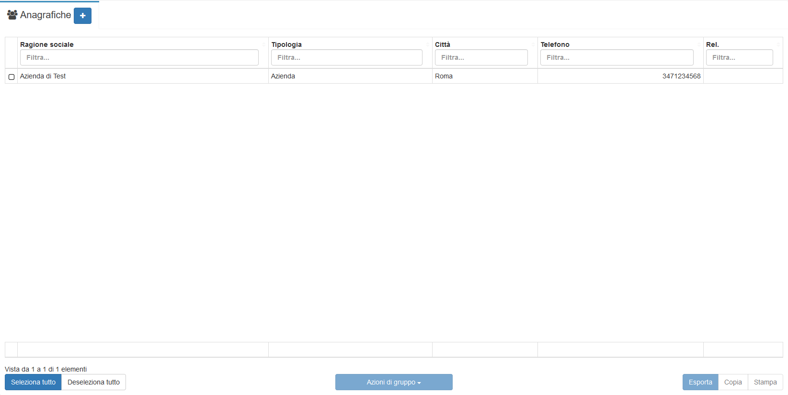
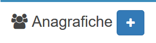
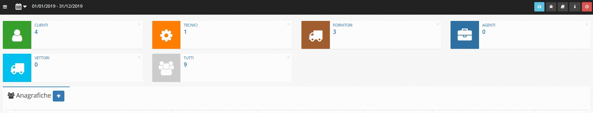
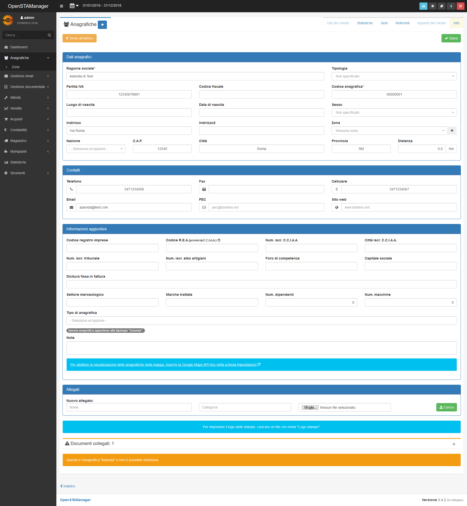
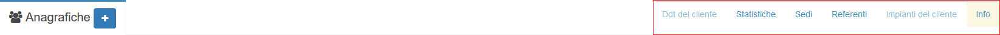

# Moduli e plugin

I moduli sono la componente principale della struttura di OpenSTAManager. Sono progettati per avere una struttura facilmente personalizzabile e mantenere comportamenti indipendenti dal resto del software.

Ogni modulo del gestionale è raggiungibile attraverso il [menu laterale](./#navigazione), ma può presentare una grafica personalizzata sulla base della funzione a cui è dedicato. Esistono però alcune caratteristiche comuni che si possono individuare quasi sempre, descritte in questa pagina.

Per ottenere maggiori informazioni sul funzionamento interno e specifico di un modulo, è necessario visitare la relativa guida dedicata.

## Pagina principale

I moduli sono solitamente caratterizzati da due pagine, una dedicata alla visualizzazione generale di tutti i record salvati e una indirizzata alla gestione delle informazioni di un singolo record.

La pagina principale può essere composta da due strutture diverse: una tabella generale oppure un sistema di contenti personalizzati.

### Tabella generale

La schermata principale più comune nei moduli del gestionale presentano è una tabella che permette una serie di operazioni comuni su tutti gli elementi registrati all'interno del modulo:

* Scorrere e visualizzare (attraverso un click) i diversi record
* Selezionare diversi record attraverso le relative righe per esportarli (in formato CSV), stamparli o copiarli
* Selezionare dei record per effettuare delle azioni generali specifiche del modulo

Esempi di questo comportamento sono individuabili in **Anagrafiche**, **Attività**, **Articoli** e in molti altri moduli predefiniti.

### Contenuti personalizzati

Esistono alcuni moduli con requisiti particolari per la propria schermata principale, sia per motivi estetici che perché rappresentano informazioni poco compatibili al formato tabellare. In questi casi, è impossibile prevedere il tipo di informazioni presentabili e la modalità, che dipende dal singolo modulo.

Esempi di questa struttura sono presenti nei moduli **Dashboard** e **Statistiche**.

## Operazioni sui record

Nel caso i moduli presentino una struttura di record gestibili singolarmente tramite la tabella generale, sono solitamente disponibili della ulteriori operazioni generali di creazione e modifica dei record.


Le informazioni richieste da queste operazioni sono delegate al modulo stesso, che quindi può richiedere qualunque tipo di dato.


### Creazione record

I moduli che permettono la creazione di nuovi elementi presentano un pulsante apposito  vicino all'intestazione della pagina.

Una volta cliccato il pulsante in questione, verrà aperta una schermata sovrapposta al resto del gestionale ch permettere di inserire le informazioni del nuovo elemento.

### Modifica record

I moduli che permetto la modifica e la visualizzazione dei propri record permettono l'apertura di una schermata apposita al click sulla riga del record nella tabella principale. Questa schermata può chiedere e contenere molte più informazioni rispetto alla tabella generale e alla schermata di creazione.

## Gestione dei moduli

Le operazioni di gestione dei moduli, quali abilitazione e disabilitazione, sono disponibili attraverso il modulo [Stato dei servizi](stato-dei-servizi.md).

## Gestione degli upload

Alcuni moduli presentano una componente generale per permettere l'inserimento di file di vario tipo all'utente finale del gestionale. Questa funzione viene spiegata più nel dettaglio in [Gestione upload](gestione-upload.md).

## Plugin

I plugin sono dei moduli che sono sottoposti alla gestione gerarchica di un altro modulo, e pertanto possono essere considerati dei sotto-moduli. Ogni modulo può possedere un numero variabile di plugin, visibili nella sezione in alto a destra della schermata dei moduli.

I plugin possono presentare comportamenti molto diversi, e sono in generale separati dal modulo a cui appartengono, malgrado vi siano collegati fortemente.


Per gli amministratori, è inoltre presente un plugin denominato **Info** che permette di visualizzare la cronologia del record.


## Campi personalizzati


Questa funzione è di rilevanza per chi desidera personalizzare alcune delle informazioni presentate dal gestionale senza modificare in modo consistente il codice generale.


A partire dalla versione 2.4 è possibile sfruttare dei campi personalizzati per aggiungere informazioni ai moduli principali in modo dinamico.

Questi campi sono gestiti a livello di database attraverso le tabelle `zz_fields` e `zz_field_record`, che si occupano rispettivamente della gestione generale dei campi e del salvataggio dei record personalizzati. Le procedure automatiche di gestione di questi campi sono integrate nei file `actions.php`, `editor.php` e `add.php`.

E' eventualmente disponibile il modulo **Campi personalizzati**, da abilitare, per la gestione dinamica di queste informazioni.


I campi creati in questo modo non sono utilizzabili per interagire con il resto del gestionale.

