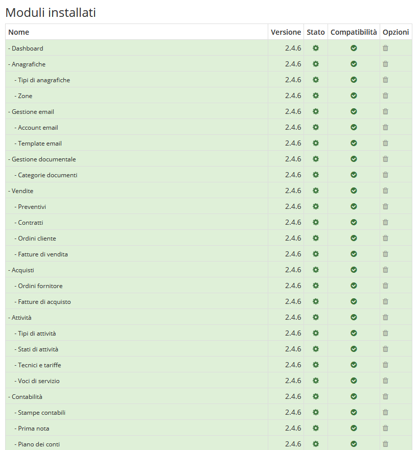
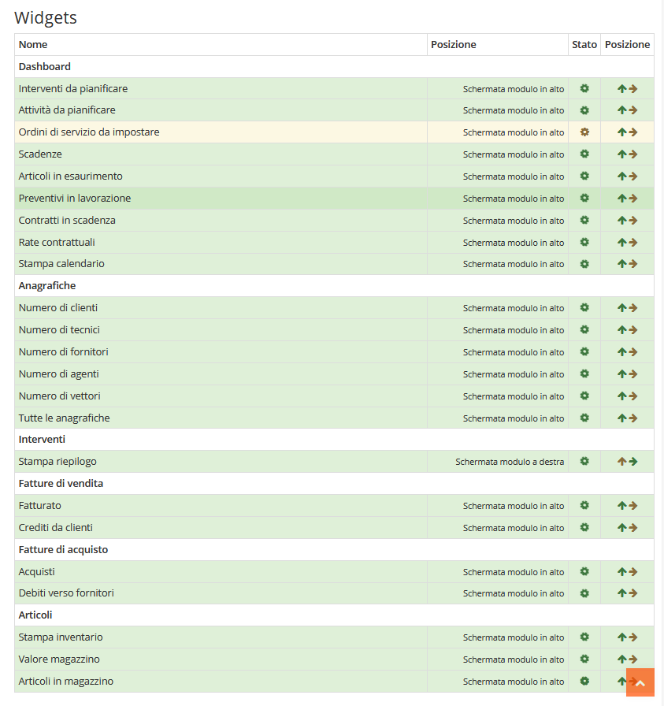

# Stato dei servizi

Il modulo **Stato dei servizi** permette di visualizzare e gestire i componenti di OpenSTAManager a partire da un'unica interfaccia gerarchica.

## Moduli installati

Visualizza una serie di informazioni relative ai moduli, quali:

* Nome
* Versione
* Stato
* Compatibilità
* Opzioni


Cliccando sopra un ingranaggio si può disabilitare un _modulo_


## Widgets

Visualizza una serie di informazioni relative ai _Widgets_, quali:

* Nome
* Posizione
* Stato
* Posizione (per modificare la _Posizione_ di un determinato _Widget_)


Cliccando sopra una freccia si può modificare la posizione di un _Widget_

