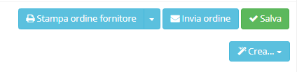

# Azioni aggiuntive

Selezionando o creando un _record_ in **Ordini fornitore** sono presenti nella parte in alto a destra dei _plugin_ che consentono diverse opzioni quali:

* stampa ordine fornitore
  * stampa ordine fornitore(senza prezzi)
* invia ordine (tramite mail)
* Crea
  * Ddt
  * Fattura
  * Attività
