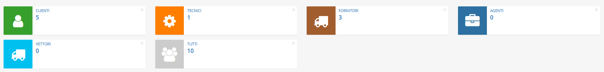

# Anagrafiche


Il modulo **Anagrafiche** permette all’azienda di archiviare tutte le informazioni riguardanti gli individui e gli enti con cui si instaura una relazione lavorativa.


Proprio per facilitare la categorizzazione di questi _stakeholder_, sono disponibili cinque principali tipologie di anagrafiche:

* Agenti
* Clienti
* Fornitori
* Tecnici
* Vettori

Il gestionale permette inoltre di memorizzare le informazioni relative ai referenti aziendali e alle sedi lavorative delle società esterne, generando autonomamente statistiche basilari riguardanti interventi eseguiti, fatture emesse, preventivi effettuati e contratti lavorati.

## Navigazione

Il modulo è raggiungibile attraverso il menu laterale del gestionale, sotto il link **Anagrafiche**.

## Caratteristiche

Questo modulo possiede un modulo incentrato sulla gestione delle zone lavorative (denominato [**Zone**](zone.md)) e uno sulle relazioni, raggiungibili all'espansione del menu laterale.

La schermata principale del modulo è strutturata secondo la tabella generale predefinita, e presenta 6 widget per il filtraggio automatico delle anagrafiche per tipo:

* Agenti
* Clienti
* Fornitori
* Tecnici
* Vettori
* Tutti

Sono inoltre presenti 7 [plugin](plugin/) nella sezione di modifica del modulo:

* [Impianti del cliente](plugin/impianti-del-cliente.md)
* [Dichiarazioni d'intento](plugin/dichiarazioni-dintento.md)
* [Storico attività](plugin/storico-attivita.md)
* [Ddt del cliente](plugin/ddtdelcliente.md)
* [Statistiche](plugin/statistiche.md)
* [Sedi](plugin/sedi.md)
* [Referenti](plugin/referenti.md)

Di questi, **Ddt del cliente** e **Impianti del cliente** sono utilizzabili esclusivamente per anagrafiche di tipo _Cliente_.

## Particolarità


Il modulo presenta la possibilità di creare una singola anagrafica di tipo _Azienda_ per motivi logico-funzionali. Questa anagrafica viene inoltre memorizzata nelle impostazioni di OpenSTAManager sotto l'impostazione nascosta **Azienda predefinita**.

Inoltre, l'eventuale eliminazione dei _record_ viene effettuata a livello logico, per evitare di rimuovere informazioni necessarie al resto del gestionale. Sarà quindi possibile ripristinare, sotto richiesta di assistenza, eventuali elementi rimossi erroneamente.

