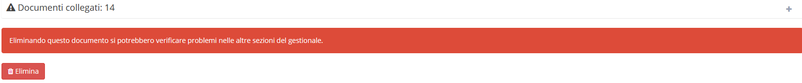

# 🖌 Modifica

Per modificare un'anagrafica si dovrà cliccare sul record interessato per aprire la schermata di dettaglio. Da qui sarà possibile completare e modificare _tutte_ le informazioni che il gestionale supporta per le anagrafiche.&#x20;

In questa schermata sarà possibile distinguere 6 diverse sezioni:

* [Dati anagrafici](modifica.md#dati-anagrafici)
* [Sede legale](modifica.md#sede-legale)
* [Geolocalizzazione](modifica.md#geolocalizzazione)
* [Informazioni per tipo di anagrafica](modifica.md#informazioni-per-tipo-di-anagrafica)
* [Informazione aggiuntive](modifica.md#informazioni-aggiuntive)
* [Allegati](modifica.md#allegati)

## 👦 Dati anagrafici

Nella prima sezione è possibile procedere alla modifica delle informazioni di base dell'anagrafica in questione:

* Denominazione (Ragione sociale o Nome e Cognome)
* Partita IVA
* Tipologia (Azienda/Privato/Ente pubblico)
* Codice Fiscale
* Codice anagrafica
* Codice destinatario
* PEC
* Sito web

.png>)

## 🏭 Sede legale

Nella seconda sezione è possibile trovare:

* Indirizzo
* C.A.P.
* Città
* Provincia
* Nazione
* Telefono
* Cellulare
* Email
* Fax
* Zona
* Distanza
* Opt-out per newsletter (attivando questa opzione l'anagrafica verrà esclusa dai destinatari di eventuali Newsletter)

.png>)

## 🗺️ Geolocalizzazione


In questa sezione è possibile visualizzare attraverso _Google Maps_ l'indirizzo indicato ed eventualmente definire manualmente latitudine e longitudine.


Per fare ciò basta cliccare sopra il link mostrato all'interno del riquadro:

.png>)

Successivamente si verrà indirizzati in _impostazioni_ per inserire un [_Google Maps API Key_ ](../../api/configurazione-google-maps-api-key.md)valido.

Andando a inserire questa chiave in Strumenti/Impostazioni/API/Google Maps API key, dall'anagrafica cliente sarà ora possibile visualizzare la sua locazione in Geolocalizzazione.

.png>)

## ℹ️ Informazioni per tipo di anagrafica

In questa sezione si possono impostare dei valori predefiniti in base al tipo di anagrafica:

### 👨 Cliente

* Provenienza cliente
* Pagamento predefinito
* IVA predefinita
* Piano di sconto/magg. su articoli
* Agente principale
* Piano dei conti cliente\*
* Relazione con il cliente
* Banca predefinita per accrediti
* Ritenuta d'acconto predefinita
* Indirizzo di fatturazione
* Agenti secondari
* Tipo attività predefinita

.png>)

### 💁‍♂️ Fornitore

* Pagamento predefinito
* Iva predefinita
* Piano di sconto/magg. su articoli
* Banca predefinita per addebiti
* Ritenuta d'acconto predefinita
* Piano dei conti fornitore\*

.png>)

### 🧑‍💼 Cliente e Fornitore

* Abilitare lo split payment
* Dicitura fissa in fattura

.png>)

### 🧑‍🔧 Tecnico

* Colore

## ⌨️ Informazioni aggiuntive

In questa sezione include elementi non fondamentali per ogni tipologia di anagrafica, ma che potrebbero essere utili in base alle necessità dell'utente.

.png>)

## 🛄 Allegati

In questa sezione è possibile caricare un file dal proprio computer specificandone la categoria.


**Attenzione:** Selezionando l'anagrafica **Azienda** è possibile impostare il logo dell'azienda, caricando un file immagine con risoluzione 302 x 111 , e modificandone il campo **Nome** con **"Logo stampe"**.

Questo permetterà di visualizzare in tutte le stampe cartacee il logo appena caricato.


.png>)

## 🗳️ Altro

Quando esiste un collegamento interno di un'anagrafica con altre componenti del gestionale, la sua eliminazione non è consentita.

\*Se l'anagrafica che si va a creare è del tipo cliente o fornitore, una volta completata la sua creazione, il gestionale provvederà a creare i relativi conti nel piano dei conti.
