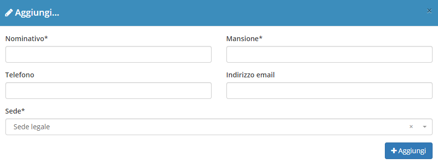

# Referenti


Il plugin **Referenti** è una componente del modulo **Anagrafiche** dedicata alla completa gestione degli eventuali referenti relativi alle anagrafiche registrate all'interno di OpenSTAManager.


Può essere sfruttato per creare una rubrica di contatti per l'anagrafica e indicare una specifica persona rilevante per eventuali **Attività**, **Contratti** e **Preventivi**.

## Navigazione

Il plugin è raggiungibile, all'interno dell'area di modifica di un _record_ del modulo **Anagrafiche**, attraverso il menu dedicato sotto la dicitura **Referenti**.

## Caratteristiche

La schermata principale del plugin è strutturata secondo la tabella generale predefinita, presentando inoltre la possibilità di creare e modificare gli elementi attraverso strutture grafiche che si sovrappongono agli altri contenuti (_modal_).

### Creazione

La creazione di nuovi elementi segue il funzionamento standard del gestionale, necessitando il click sul pulsante apposito all'interno dell'intestazione del plugin.

Viene quindi reso possibile compilare tutte le informazioni di base relative al nuovo referente da registrare:

* Nominativo
* Mansione
* Telefono
* Indirizzo email
* Sede (per maggiori informazioni, visitare la documentazione del plugin [**Sedi**](sedi.md))

### Modifica

La schermata di modifica risulta identica a quella di creazione, permettendo in aggiunta l'eventuale eliminazione del referente dal sistema.

