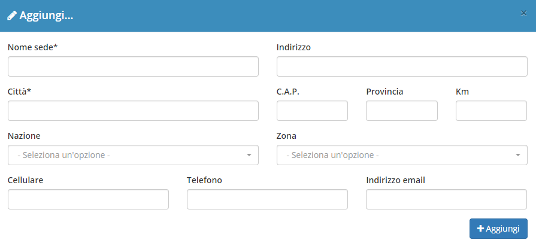

# Sedi


Il plugin **Sedi** è una componente del modulo **Anagrafiche** dedicata alla completa gestione di tutte le eventuali sedi delle anagrafiche registrate all'interno di OpenSTAManager.


## Navigazione

Il plugin è raggiungibile, all'interno dell'area di modifica di un _record_ del modulo **Anagrafiche**, attraverso il menu dedicato nella sezione alta a destra della schermata, sotto la dicitura **Sedi**.

## Caratteristiche

La schermata principale del plugin è strutturata secondo la tabella generale predefinita, presentando inoltre la possibilità di creare e modificare gli elementi attraverso strutture grafiche che si sovrappongono agli altri contenuti \(_modal_\).

### Creazione

La creazione di nuovi elementi segue il funzionamento standard del gestionale, necessitando il click sul pulsante apposito all'interno dell'intestazione del plugin.

Viene quindi reso possibile compilare tutte le informazioni di base relative alla nuova sede da creare:

* Nome sede
* Indirizzo
* Città
* CAP
* Provincia
* Km
* Nazione
* Zona \(per maggiori informazioni, visitare la documentazione del modulo [**Zone**](../zone.md)\*\*\*\*
* Cellulare
* Telefono
* Indirizzo email

### Modifica

La schermata di modifica, sebbene molto simile a quella di creazione, permette in particolare di impostare altre informazioni secondarie.

In particolare, se l'impostazione [**Google Maps API key**](../maps.md) viene impostata, sarà possibile visualizzare attraverso Google Maps l'indirizzo indicato ed eventualmente definire manualmente longitudine e latitudine.

## Particolarità


La sede legale, predefinita per l'anagrafica, non viene registrata allo stesso modo delle altre sedi. Sarà pertanto impossibile eliminare completamente la sede legale da un'anagrafica.


