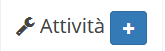
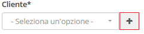
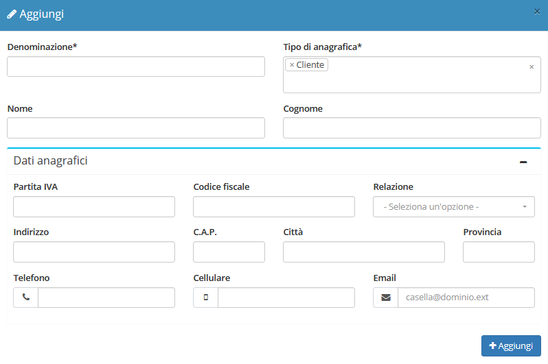

# Creazione

La creazione di nuovi elementi segue il funzionamento standard del gestionale, necessitando il click sul pulsante apposito all'interno dell'intestazione del modulo.

Il modulo **Attività** presenta quindi la possibilità di inserire le informazioni complete relative alla nuova attività da creare.

## Caratteristiche

Il sistema di creazione di un nuovo elemento permette il completamento delle informazioni di base fondamentali per il processo di inizializzazione dell'attività. Queste vengono divise in quattro sezioni principali:

* Dati intervento
* Dettagli aggiuntivi
* Assegnazione tecnici
* Ore di lavoro

### Dati intervento

La sezione _Dati intervento_ si occupa della gestione dei dati dell'attività interagenti con altri moduli:

* Cliente dell'attività
* Ordine collegato
* Tipo
* Stato
* Preventivo collegato
* Contratto collegato
* Data/ora richiesta
* Richiesta

### Dettagli aggiuntivi

Parallelamente, la componente _Dati intervento_ permette la compilazione di alcune informazioni generali, quali:

* Zona
* Sede destinazione
* Per conto di
* Data/ora scadenza
* Impianto
* Componenti

### Assegnazione tecnici

La sezione _Assegnazione tecnici_ si occupa della gestione dei tecnici dell'attività:

* Tecnici assegnati

### Ore di lavoro

La sezione _Ore di lavoro_ si occupa di determinare durata dell'attività e il tecnico assegnato, composto dai seguenti campi:

* Inizio attività
* Fine attività
* Tecnici

### Creazione anagrafica al volo

Nella schermata di creazione di una nuova attività viene permessa la creazione al volo dell'anagrafica di tipo _Cliente_ relativa al nuovo _record_. Questa funzionalità viene permessa dal pulsante dedicato a destra del selettore del campo _Cliente_.

La gestione della creazione viene quindi delegata al modulo **Anagrafiche**, permettendo l'inserimento delle informazioni standard documentate nella [sezione relativa](../anagrafiche/creazione.md) attraverso un _modal_ sovrapposto al resto del contenuto.

Una volta completata la creazione in questione, l'anagrafica creata verrà automaticamente selezionata.

## Particolarità

Creare un'attività senza tecnici selezionati la aggiungerà al widget **Promemoria attività da pianificare** della **Dashboard**.

