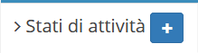
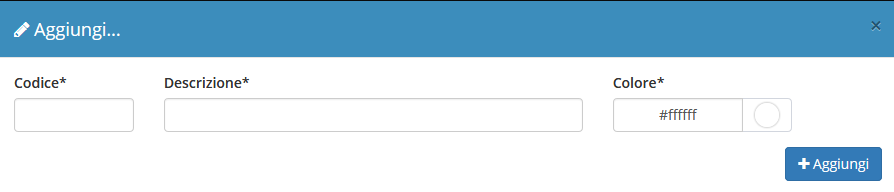

# Creazione

La creazione di nuovi elementi segue il funzionamento standard del gestionale, necessitando il click sul pulsante apposito all'interno dell'intestazione del modulo.

Il modulo **Stati di attività** presenta quindi la possibilità di inserire le informazioni complete relative ad un nuovo stato di attività da creare.

