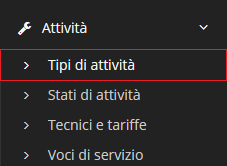

# Tipi di attività


Il modulo **Tipi di attività** permette di creare una sorta di tariffario da assegnare ad un **Tecnico** per lo svolgimento di un'attività. Offre di base due _record_:


* GEN(Generico)
* ODS(Ordine di servizio)

## Navigazione

Il modulo **Tipi di attività** è raggiungibile attraverso il menu laterale del gestionale, sotto il link **Attività**.

## Caratteristiche

Se i **Tipi di attività** sono collegati a degli interventi andando a cancellare il **Tipo di attività** collegato ad un determinato intervento, viene rimosso anche l'intervento.
