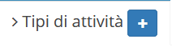

# Creazione

La creazione di nuovi elementi segue il funzionamento standard del gestionale, necessitando il click sul pulsante apposito all'interno dell'intestazione del modulo.

Il modulo **Tipi di attività** presenta quindi la possibilità di inserire le informazioni relative al nuovo tipo di attività da creare, mostrando di default una versione basilare delle informazioni richieste.

**ATTENZIONE**


**Tempo standard** accetta valori compresi tra 0,25 e 25 ore, esempi:


* 60 minuti= 1 ora
* 30 minuti= 0,5 ore
* 15 minuti = 0,25 ore
