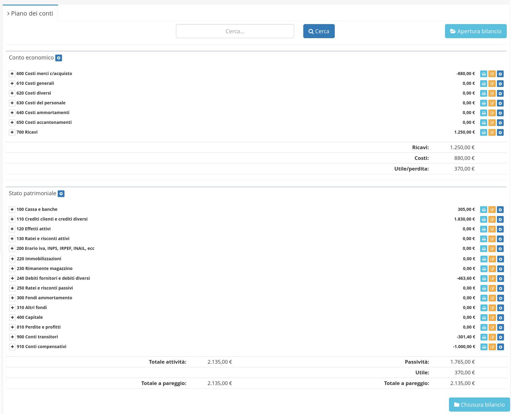

# 📖 Piano dei conti


Da questo modulo è possibile visualizzare il piano dei conti, diviso in Conto economico e Stato patrimoniale.



E' possibile visualizzare nel dettaglio gli elementi che lo compongono espandendo il menu a lato delle singole voci.


 (1).png>)

## ➕ Creazione

Per creare un nuovo conto si dovrà cliccare sul tasto (+).

Andranno qui inserite le informazioni relative al nuovo conto:

* Numero
* Descrizione

.png>)

## 🖌️ Modifica

Per modificare un conto si deve cliccare sul tasto .

Da qui sarà possibile modificare:

* Numero
* Descrizione
* Utilizza come (Costo, Ricavo, Ricavo e Costo)

 (1).png>)
