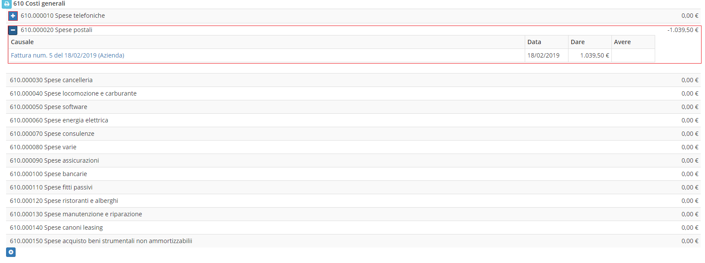

# Piano dei conti


Il modulo **Piano dei conti** visualizza un documento con tutti i conti registrati da un'azienda o da un privato.


## Navigazione

Il modulo è raggiungibile attraverso il menu laterale del gestionale, sotto il link **Contabilità**.

### Caratteristiche

Le spese inserite nella modifica di una **fattura** vengono visualizzate cliccando sul tasto **+** affianco al costo indicato:

