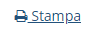

# Creazione

La creazione di nuovi elementi si esegue cliccando sul simbolo  (2) (1) (1) (1).PNG>) all'inizio di ogni sezione.

Inoltre, cliccando sul simbolo  il gestionale permette di fare una stampa del relativo conto. Per avere invece una stampa di tutti i _conti_, cliccare su  presente in alto a destra.
