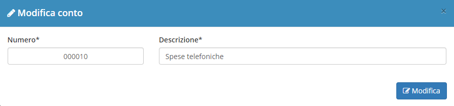

# Modifica

La sezione di modifica degli elementi del modulo segue il sistema standard del gestionale, necessitando il click sulla riga relativa al _record_ all'interno della tabella della schermata principale.

## Modifica

Nella sezione **costi generali** andando sopra un record,cliccando sul simbolo  è possibile modificare:

* Numero
* Descrizione

Cliccando sul simbolo  è possibile eliminare il _conto_ selezionato.

