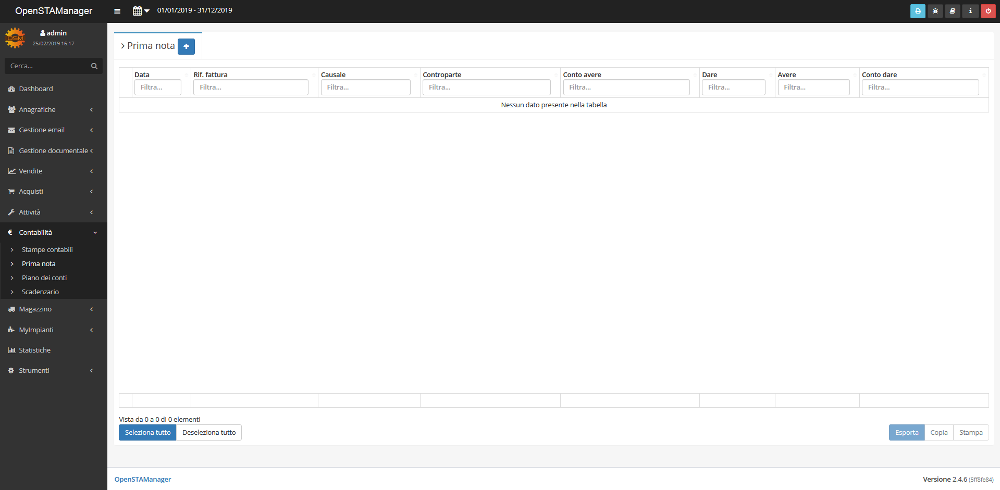
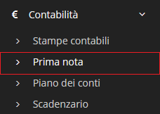

# Prima nota


Il modulo **prima nota** è uno strumento che viene utilizzato per registrare movimenti contabili di un'attività. I movimenti sono visualizzabili nel [piano dei conti](../pianodeiconti/).


## Navigazione

Il modulo è raggiungibile attraverso il menu laterale del gestionale, sotto il link **Contabilità**.

