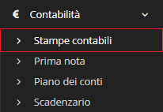

# Stampe contabili


Il modulo **Stampe contabili** permette all'utente di stampare:


* Registri iva
  * Registro IVA vendite
  * Registro IVA acquisti
  * Liquidazione IVA
* Comunicazione dati fatture
* Fatturato
  * Fatturato in entrata
  * Fatturato in uscita

## Attenzione


Le suddette stampe contabili non sono da considerarsi valide ai fini fiscali.


## Navigazione

Il modulo è raggiungibile attraverso il menu laterale del gestionale, sotto il link **Contabilità**.

