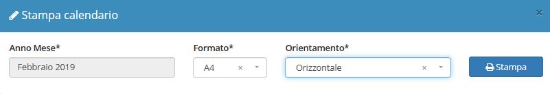

# Dashboard

**Dashboard** è il modulo principale aperto come prima pagina di default da OpenSTAManager.

Grazie al calendario, questo modulo offre una visione generale degli I**nterventi** e attraverso l'applicazione dei filtri permette possibile ridurre il campo di ricerca per uno sguardo più approfondito su determinate operazioni.

Attraverso il calendario è inoltre possibile creare un intervento, [clicca qui](creazione.md#da-calendario) per aprire la pagina di **creazione** di un intervento.

L' utente ha a disposizione delle strutture, chiamate _widget,_ che permettono di visualizzare:

* Promemoria contratti da pianificare
* Promemoria attività da pianificare
* Notifiche interne
* Scadenze
* Articoli in esaurimento
* Preventivi in lavorazione
* Contratti in scadenza
* Rate contrattuali
* Stampa calendario
* Attività nello stato da programmare
* Attività confermate

Un _widget_ molto utile è **Stampa calendario** , cliccando su di esso, specificando _anno_ e _mese,_ è possibile avere una stampa del calendario.

## Navigazione

Il modulo è raggiungibile attraverso il menu laterale del gestionale, sotto il link **Dashboard**

## Caratteristiche

L' interfaccia della **Dashboard** è personalizzabile rimuovendo o aggiungendo _widget_ a piacimento.

Cliccando su un intervento nel calendario è possibile accedere alla schermata di modifica:

**Rimozione dei widget**

Se un _widget_ è stato rimosso è possibile aggiungerlo tramite il modulo **Strumenti**, cliccando il modulo **Aggiornamenti** selezionando l'ingranaggio del _widget_ che si desidera aggiungere.

Dal modulo **Strumenti** è anche possibile disattivare un _widget_ attivo, selezionando l'ingranaggio del _widget_ che si desidera disattivare.


Per maggiori approfondimenti andare sul modulo [Aggiornamenti](../strumenti/aggiornamenti.md).


